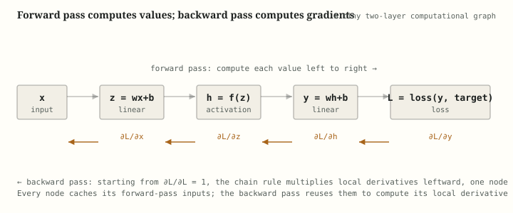

# Backpropagation, Demystified: How a Network Learns From Its Own Mistakes

**Pull quotes:**
- "A neural network doesn't know it's wrong until you tell it exactly how wrong, and exactly whose fault it was. Backpropagation is the bookkeeping that assigns blame."
- "The chain rule was two hundred years old before it became the single most economically important piece of calculus on the planet."
- "Every weight in a billion-parameter model gets updated by the same one-line idea, applied a billion times: how much did *you*, specifically, contribute to the mistake?"

---

Backpropagation is the algorithm that tells every weight in a neural network how much it was responsible for the network's error, so it knows which direction — and by how much — to change. This article works through where the idea came from, what problem it actually solves, the calculus underneath it worked out in numbers, what it doesn't fix, and how it fits into the training loop that produced every modern deep learning model.

---

## Table of contents

1. [How it came to be](#1-how-it-came-to-be)
2. [What problem does it solve](#2-what-problem-does-it-solve)
3. [The forward pass and the backward pass](#3-the-forward-pass-and-the-backward-pass)
4. [The chain rule, in plain language](#4-the-chain-rule-in-plain-language)
5. [A full worked example, by hand](#5-a-full-worked-example-by-hand)
6. [A runnable PyTorch comparison](#6-a-runnable-pytorch-comparison)
7. [What backpropagation doesn't solve](#7-what-backpropagation-doesnt-solve)
8. [Alternatives and relatives](#8-alternatives-and-relatives)
9. [Summary table](#9-summary-table)
10. [Key takeaways](#10-key-takeaways)
11. [Further reading](#11-further-reading)

---

## 1. How it came to be

The calculus behind backpropagation is not new — the chain rule dates to Gottfried Leibniz in the 1670s, and nothing about *differentiating a composite function* was invented for neural networks. What took nearly three more centuries was recognizing that a network's error could be treated as one enormous composite function of every weight in it, and that the chain rule could be applied *automatically and efficiently*, layer by layer, instead of by hand.

**The early attempts (1960s–1970s).** Ideas resembling backpropagation surfaced piecemeal in control theory and applied mathematics — Henry J. Kelley and Arthur Bryson worked out gradient-based methods for optimal control in the early 1960s, and Seppo Linnainmaa's 1970 master's thesis described what is, in essence, the modern algorithm (reverse-mode automatic differentiation) without connecting it to neural networks at all. Paul Werbos's 1974 PhD thesis applied the idea specifically to training multi-layer networks, but it went largely unnoticed for a decade.

**The paper that made it stick (1986).** David Rumelhart, Geoffrey Hinton, and Ronald Williams published *"Learning representations by back-propagating errors"* in *Nature* in 1986. It wasn't the first description of the algorithm, but it was the one that demonstrated, clearly and convincingly, that multi-layer networks with hidden units could learn useful internal representations by this method — and it gave the field a name and a rallying point. This is the paper usually credited with popularizing backpropagation, even though the mathematics had been independently rediscovered several times before it.

**Why it took so long to matter.** For most of the 1990s and 2000s, backpropagation was known but underused: networks stayed shallow, because deep networks trained this way ran straight into the vanishing-gradient problem (see [Section 7](#7-what-backpropagation-doesnt-solve) and the companion [activation functions article](activation-functions.md), which covers this failure mode directly). It took better activation functions, better initialization schemes, GPUs fast enough to make the matrix multiplications practical at scale, and vastly larger datasets before backpropagation-trained networks began outperforming every hand-engineered alternative. The algorithm itself barely changed in that time — the surrounding infrastructure had to catch up to it.

---

## 2. What problem does it solve

A neural network's whole job during training is to adjust its weights so its predictions get less wrong. That requires answering one question, for every single weight in the network, potentially billions of them: *if I nudge this one weight up slightly, does the error go up or down, and by how much?*

That quantity — how sensitive the error is to a small change in one specific weight — is a **partial derivative** (technically, a **gradient**, since a weight matrix has many entries). Once you have it for every weight, you can update each weight a small step in the direction that reduces the error. Repeat this millions of times and the network gradually gets better.

**The naive approach doesn't scale.** You could, in principle, estimate each weight's effect on the error numerically: nudge the weight by a tiny amount, rerun the entire forward pass, see how much the error changed, and divide. This is called *numerical differentiation*, and it works for a handful of weights. It is hopeless for a network with a billion weights, because it requires a full forward pass *per weight* — a billion forward passes to get one gradient update.

**What backpropagation actually is.** Backpropagation is a way to compute the exact gradient for *every* weight in the network using just **one** forward pass and **one** backward pass — not one pass per weight. It does this by applying the chain rule of calculus systematically, starting from the error at the output and working backward through the network, reusing intermediate results at every step instead of recomputing them from scratch. This reduction — from "one pass per weight" to "one pass total" — is the entire reason training networks with billions of parameters is computationally feasible at all.

It's worth being precise about what backpropagation is *not*: it is not the learning algorithm itself, and it does not decide how big a step to take. It only computes gradients. A separate algorithm — an **optimizer** like SGD or Adam — takes those gradients and decides how to actually update the weights (see the companion [optimizers article](optimizers.md) for that half of the story). Backpropagation answers "which direction, and how sensitively"; the optimizer answers "how far to step."

---

## 3. The forward pass and the backward pass

Every training step has two halves, always run in this order.



**The forward pass.** The input is pushed through the network's layers in order — linear transformation, activation function, linear transformation, and so on — producing a prediction. That prediction is compared against the true target using a **loss function** (see the companion [loss functions article](loss-functions.md)), producing a single number, $\mathcal{L}$, that scores how wrong the network was. Every intermediate value computed along the way — every $z$ and every $h$ in the diagram above — is cached in memory rather than discarded, because the backward pass needs them.

**The backward pass.** Starting from the loss and working backward toward the input, each node in the computational graph computes two things: how much the loss changes with respect to *its own output* (which it receives from the node after it), and how much the loss changes with respect to *its own inputs* (which it computes using its local derivative and passes further back). By the time the backward pass reaches the first layer, every weight in the network has an associated gradient — a signed number saying "increasing this weight slightly would increase the loss by approximately this much."

The key insight that makes this efficient: **each node only needs to know its own local derivative.** A linear layer's node doesn't need to understand what the activation function three layers down does — it just needs to know how to differentiate itself, multiply that by the gradient handed to it from downstream, and pass the result further upstream. This local-knowledge-only design is what lets the same algorithm work identically whether the network has 3 layers or 300.

---

## 4. The chain rule, in plain language

Everything backpropagation does reduces to one calculus rule, applied over and over.

**The chain rule for a single chain.** If $y$ depends on $u$, and $u$ depends on $x$, then:

$$\frac{dy}{dx} = \frac{dy}{du} \cdot \frac{du}{dx}$$

**In plain language:** "how much does $y$ change when $x$ changes" equals "how much does $y$ change when $u$ changes" times "how much does $u$ change when $x$ changes." You can't ask how $x$ affects $y$ directly, because $x$ only touches $y$ *through* $u$ — so you measure the effect in two hops and multiply them.

**A tiny numeric example before any network is involved.** Say $u = 2x$ and $y = u^2$. If $x=3$, then $u=6$ and $y=36$. What happens to $y$ if $x$ nudges up slightly?

$$\frac{dy}{du} = 2u = 12 \qquad \frac{du}{dx} = 2 \qquad \frac{dy}{dx} = 12 \times 2 = 24$$

Check it directly: $y = (2x)^2 = 4x^2$, so $dy/dx = 8x = 8 \times 3 = 24$. Same answer, two different routes — the chain rule is just a way of getting there one small step at a time instead of expanding the whole formula first, which matters enormously once "the whole formula" is a network with a hundred layers.

**Now stretch that chain across a whole network.** For the tiny network in the diagram above — $x \to z \to h \to y \to \mathcal{L}$ — the gradient of the loss with respect to the very first input is the product of every local derivative along the way:

$$\frac{\partial \mathcal{L}}{\partial x} = \frac{\partial \mathcal{L}}{\partial y} \cdot \frac{\partial y}{\partial h} \cdot \frac{\partial h}{\partial z} \cdot \frac{\partial z}{\partial x}$$

- $\partial \mathcal{L}/\partial y$ — how sensitive the loss is to the final prediction. This is where the backward pass *starts*, and it's usually the easiest derivative in the whole chain (for mean-squared-error loss, for instance, it's just $y - \text{target}$).
- $\partial y/\partial h$ — the local derivative of the second linear layer, which turns out to just be its weight.
- $\partial h/\partial z$ — the derivative of the activation function, evaluated at $z$. This is exactly the term covered at length in the [activation functions article](activation-functions.md#2-where-they-live-in-a-network) — small or zero values here are what cause vanishing or dead gradients.
- $\partial z/\partial x$ — the local derivative of the first linear layer, again just its weight.

Each factor is *local* — a node only ever needs to differentiate itself — and the backward pass computes them right to left, reusing the running product at every step instead of recomputing the whole chain from scratch each time. That reuse is the entire computational saving over the naive "nudge one weight, rerun everything" approach from [Section 2](#2-what-problem-does-it-solve).

**Why weights, not just inputs, get gradients.** The example above tracks $\partial \mathcal{L}/\partial x$, the sensitivity to the *input* — useful for illustrating the chain, but not what actually gets updated during training. In practice, backpropagation computes $\partial \mathcal{L}/\partial w$ for every *weight* $w$ in every layer, using exactly the same mechanism: the gradient arriving at a linear layer from downstream gets multiplied by that layer's local derivative with respect to its own weight (which, for $z = wx + b$, is simply $x$ — the input that weight was multiplying). This is why the forward pass's cached values matter so much: the gradient for a weight literally depends on what value flowed through it on the way forward.

---

## 5. A full worked example, by hand

Take the smallest network that still has everything: one input, one hidden unit with a sigmoid activation, one output, and mean-squared-error loss.

**Setup.** Input $x = 2$, target $t = 1$. Weights initialized as $w_1 = 0.5$, $b_1 = 0$ (input → hidden), and $w_2 = 1.0$, $b_2 = 0$ (hidden → output). Activation is sigmoid, $\sigma(z) = 1/(1+e^{-z})$.

**Forward pass.**

$$z = w_1 x + b_1 = 0.5 \times 2 + 0 = 1.0$$

$$h = \sigma(z) = \sigma(1.0) = \frac{1}{1+e^{-1.0}} = 0.7311$$

$$y = w_2 h + b_2 = 1.0 \times 0.7311 + 0 = 0.7311$$

$$\mathcal{L} = \frac{1}{2}(y - t)^2 = \frac{1}{2}(0.7311 - 1)^2 = \frac{1}{2}(0.2689)^2 = 0.03616$$

The network predicted 0.7311 against a target of 1 — too low, so the loss should push $y$ upward.

**Backward pass, one factor at a time.**

Start with the loss's sensitivity to the output:

$$\frac{\partial \mathcal{L}}{\partial y} = (y - t) = 0.7311 - 1 = -0.2689$$

(This is the derivative of $\frac{1}{2}(y-t)^2$ — the $\frac{1}{2}$ was chosen specifically so this derivative comes out clean.)

Now the output layer's local derivative, needed for the weight update $w_2$:

$$\frac{\partial y}{\partial w_2} = h = 0.7311 \qquad \Rightarrow \qquad \frac{\partial \mathcal{L}}{\partial w_2} = \frac{\partial \mathcal{L}}{\partial y}\cdot\frac{\partial y}{\partial w_2} = -0.2689 \times 0.7311 = -0.1966$$

To keep going backward, propagate the gradient through $w_2$ to reach $h$:

$$\frac{\partial \mathcal{L}}{\partial h} = \frac{\partial \mathcal{L}}{\partial y}\cdot\frac{\partial y}{\partial h} = -0.2689 \times w_2 = -0.2689 \times 1.0 = -0.2689$$

Now the sigmoid's own local derivative, evaluated at $z=1.0$ (reusing the shortcut $\sigma'(z) = \sigma(z)(1-\sigma(z))$ from the [activation functions article](activation-functions.md#sigmoid-logistic-function-1980s2000s)):

$$\frac{\partial h}{\partial z} = \sigma(z)(1-\sigma(z)) = 0.7311 \times (1-0.7311) = 0.1966$$

$$\frac{\partial \mathcal{L}}{\partial z} = \frac{\partial \mathcal{L}}{\partial h}\cdot\frac{\partial h}{\partial z} = -0.2689 \times 0.1966 = -0.05288$$

Finally, the input layer's local derivative, needed for $w_1$:

$$\frac{\partial z}{\partial w_1} = x = 2 \qquad \Rightarrow \qquad \frac{\partial \mathcal{L}}{\partial w_1} = \frac{\partial \mathcal{L}}{\partial z}\cdot\frac{\partial z}{\partial w_1} = -0.05288 \times 2 = -0.10576$$

**What this hands to the optimizer.** Backpropagation's job stops here: it has produced $\partial \mathcal{L}/\partial w_1 = -0.10576$ and $\partial \mathcal{L}/\partial w_2 = -0.1966$. Both are negative, meaning increasing either weight would *decrease* the loss — which matches the earlier observation that the prediction was too low. An optimizer like plain gradient descent with learning rate $\eta = 0.1$ would then apply:

$$w_1 \leftarrow w_1 - \eta \frac{\partial \mathcal{L}}{\partial w_1} = 0.5 - 0.1\times(-0.10576) = 0.5106$$

$$w_2 \leftarrow w_2 - \eta \frac{\partial \mathcal{L}}{\partial w_2} = 1.0 - 0.1\times(-0.1966) = 1.0197$$

Both weights nudge upward, exactly as the sign of their gradients demanded. Run the forward pass again with these updated weights and $y$ will land slightly closer to the target $t=1$ than 0.7311 did. That's one full training step — everything a network does, a few million times over, to go from random weights to a trained model.

---

## 6. A runnable PyTorch comparison

The example above computed every derivative by hand. In practice, no one does this — frameworks like PyTorch implement **automatic differentiation**: every operation you run is silently recorded onto a computational graph, and calling `.backward()` walks that graph in reverse, applying the chain rule automatically. The snippet below reproduces the exact numbers from Section 5, first by hand-cranking the formulas, then letting `autograd` do it.

```python
import torch

# Manual version — mirrors the by-hand math in Section 5 exactly
x, t = 2.0, 1.0
w1, b1, w2, b2 = 0.5, 0.0, 1.0, 0.0

z = w1 * x + b1
h = 1 / (1 + torch.exp(torch.tensor(-z)))
y = w2 * h.item() + b2
loss = 0.5 * (y - t) ** 2
print("manual loss:", round(loss, 5))          # 0.03616

# Autograd version — same network, gradients computed automatically
x = torch.tensor(2.0)
t = torch.tensor(1.0)
w1 = torch.tensor(0.5, requires_grad=True)
w2 = torch.tensor(1.0, requires_grad=True)

z = w1 * x
h = torch.sigmoid(z)
y = w2 * h
loss = 0.5 * (y - t) ** 2

loss.backward()  # this one call does the entire backward pass from Section 5

print("dL/dw1:", round(w1.grad.item(), 5))      # -0.10576
print("dL/dw2:", round(w2.grad.item(), 5))      # -0.19660
```

`loss.backward()` reproduces exactly the two gradients derived by hand in Section 5 — `-0.10576` for $w_1$ and `-0.19660` for $w_2$ — because it's running the same chain-rule bookkeeping, just automatically and for graphs far too large to differentiate by hand. This is the mechanism underneath every `.backward()` call in every PyTorch training loop, regardless of whether the model has three parameters or three hundred billion.

---

## 7. What backpropagation doesn't solve

Backpropagation computes gradients correctly and efficiently — but a correct gradient is not the same as a *useful* one, and several well-known training failures live entirely downstream of it.

**It doesn't guarantee the gradient is a good signal.** If the activation functions in a deep network saturate, backpropagation still computes the mathematically correct gradient — it's just that the correct gradient is very close to zero. This is the vanishing-gradient problem, and it's a property of the *functions being differentiated* (see [Section 4](#2-where-they-live-in-a-network) of the activation functions article), not a flaw in the chain-rule bookkeeping itself. Backpropagation faithfully reports "there is almost no signal here" — it doesn't manufacture a better signal.

**It doesn't decide how to update weights.** As noted in [Section 2](#2-what-problem-does-it-solve), backpropagation's output is a gradient, full stop. Whether that gradient gets applied directly (plain SGD), smoothed over time (momentum), or rescaled per-parameter (Adam) is an entirely separate decision made by the optimizer — see the companion [optimizers article](optimizers.md).

**It doesn't fix a bad loss function or bad labels.** Backpropagation differentiates whatever loss function you hand it, correctly, even if that loss function is a poor match for the task or the labels feeding it are wrong. Garbage in the loss produces a mathematically impeccable gradient toward garbage.

**Memory, not compute, is often the practical bottleneck.** Because the backward pass needs every intermediate activation from the forward pass, training memory scales with network depth and batch size in a way inference does not. Techniques like gradient checkpointing exist specifically to trade recomputation for memory by deliberately *not* storing every intermediate value — a direct consequence of how backpropagation is structured.

**It's exact, not approximate — but only for the graph you actually built.** A common source of silent bugs is a computational graph that doesn't match the intended math (an operation performed outside `requires_grad` tracking, a detached tensor, a non-differentiable operation used where a differentiable one was needed). Backpropagation will happily and correctly differentiate the graph you gave it — it has no way to know that graph wasn't the one you meant to build.

---

## 8. Alternatives and relatives

Backpropagation (reverse-mode automatic differentiation applied to a loss function) is overwhelmingly the default way to train neural networks today, but it is not the only way to get a network to learn, and it's worth knowing what the alternatives actually trade away.

**Forward-mode automatic differentiation.** The same chain rule, run in the opposite direction: instead of one backward sweep computing gradients for all parameters at once, forward mode computes the sensitivity of *all* outputs to *one* input (or parameter) per pass. For a typical network with millions of parameters and a single scalar loss, this is enormously more expensive — you'd need one forward-mode pass per parameter, which is exactly the "one pass per weight" cost that backpropagation exists to avoid ([Section 2](#2-what-problem-does-it-solve)). Forward mode remains useful in settings with few inputs and many outputs, the mirror image of a typical training setup.

**Evolutionary strategies and other gradient-free methods.** Instead of computing a gradient at all, perturb the weights randomly, keep the perturbations that reduced the loss, and repeat — no calculus required anywhere. These methods parallelize trivially across machines and don't require the loss to be differentiable, which matters for tasks like reinforcement learning with non-differentiable reward signals. The tradeoff is sample efficiency: gradient-free search generally needs vastly more forward passes to make progress that backpropagation gets from a single backward pass, so it's used more as a niche tool (or as a component inside RL) than as a general training replacement.

**Feedback alignment and biologically-motivated alternatives.** A line of research (starting with Lillicrap et al., 2016) asks whether the brain could plausibly implement something like backpropagation, since standard backprop requires each layer to know the *exact transpose* of the weights of every layer ahead of it — a symmetry requirement with no obvious biological mechanism. Feedback alignment replaces those exact transposed weights with fixed random matrices and shows the network can still learn, surprisingly. This mostly matters for neuroscience and for niche hardware (analog/neuromorphic chips) where computing exact transposes is expensive — it hasn't displaced standard backpropagation for practical model training, where you don't need biological plausibility and exact gradients are cheap to get anyway.

**None of these have displaced backpropagation for standard deep learning**, precisely because it already hits a rare combination: it's exact (not approximate), and it costs about the same as one extra forward pass regardless of how many parameters the network has. Any alternative that gives up either of those properties has to buy back an enormous amount of value elsewhere to be worth using instead.

---

## 9. Summary table

| Concept | What it means | Key formula |
|---|---|---|
| Forward pass | Push input through the network, compute the loss, cache intermediates | $\mathcal{L} = \text{loss}(f(x), t)$ |
| Backward pass | Walk the computational graph in reverse, applying the chain rule at each node | $\partial \mathcal{L}/\partial x_\ell = \partial \mathcal{L}/\partial x_{\ell+1} \cdot \partial x_{\ell+1}/\partial x_\ell$ |
| Chain rule | The calculus rule that lets a derivative be computed one local hop at a time | $dy/dx = (dy/du)(du/dx)$ |
| Gradient | How sensitive the loss is to one specific weight | $\partial \mathcal{L}/\partial w$ |
| What backprop hands off | A gradient for every weight, nothing more — the optimizer decides the step | $w \leftarrow w - \eta\, \partial \mathcal{L}/\partial w$ |
| Vanishing gradient | A downstream, not backprop-caused, failure when local derivatives are small | $f'(z_\ell) \ll 1$ across many layers |
| Automatic differentiation | The general framework backpropagation is a special case of | reverse-mode AD over a computational graph |

---

## 10. Key takeaways

- **Backpropagation computes gradients, not weight updates.** It answers "how sensitive is the loss to this weight"; a separate optimizer decides how far and in what manner to actually move the weight.
- **Its entire value proposition is efficiency, not correctness.** Numerically estimating gradients one weight at a time is also correct — it's just computationally hopeless at scale. Backpropagation gets every weight's gradient from one backward pass by reusing the chain rule's local, hop-by-hop structure.
- **It's the chain rule, applied systematically to a computational graph.** Every "backward" step multiplies an incoming gradient by a local derivative and passes the result further upstream — there's no additional trick beyond that, no matter how deep the network.
- **The forward pass and backward pass are inseparable.** The backward pass depends on values cached during the forward pass; this is why training uses substantially more memory than inference.
- **A correct gradient can still be a useless one.** Saturating activations, bad losses, or mismatched computational graphs don't break backpropagation's math — they just mean the gradient it faithfully computes doesn't carry a useful training signal.
- **In practice, you never hand-derive this.** Automatic differentiation frameworks like PyTorch's `autograd` build the computational graph as operations run and call the chain rule for you — `.backward()` is backpropagation, executed automatically on whatever graph your forward pass built.

---

## 11. Further reading

- **"Learning representations by back-propagating errors"** (Rumelhart, Hinton & Williams, 1986) — the *Nature* paper that popularized backpropagation for training multi-layer networks with hidden units: nature.com/articles/323533a0

- **"Applications of advances in nonlinear sensitivity analysis"** (Werbos, 1974/1981) — the earlier PhD-thesis-derived work that applied reverse-mode differentiation to training neural-network-like systems, largely unnoticed until backpropagation's later popularization.

- **CS231n, "Backpropagation, Intuitions"** (Stanford, Karpathy et al.) — a widely used lecture note walking through the computational-graph view of backpropagation with worked examples: cs231n.github.io/optimization-2

- **"Random synaptic feedback weights support error backpropagation for deep learning"** (Lillicrap, Cownden, Tweed & Akerman, 2016) — the feedback-alignment paper referenced in [Section 8](#8-alternatives-and-relatives), on biologically-motivated alternatives: nature.com/articles/ncomms13276

- **The PyTorch autograd documentation** — for how a real framework implements the mechanism described in this article: pytorch.org/docs/stable/autograd.html

---

Backpropagation is, underneath all the framework machinery, the same three-hundred-year-old chain rule Leibniz would recognize — applied not to one function of one variable, but to a graph with a billion parameters, computed once per training step because reusing local derivatives is cheaper than recomputing the whole thing from scratch a billion separate times. Every model that has ever been trained by gradient descent — from the smallest logistic regression to the largest language model — learned by exactly this bookkeeping: one forward pass to see how wrong it was, one backward pass to find out exactly whose fault it was, and an optimizer that used that answer to nudge every weight a little closer to right.
