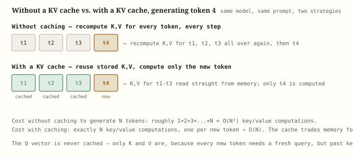

# KV Caching, Demystified: Why an LLM Doesn't Re-Read Itself on Every Token

**Pull quotes:**
- "Every token an LLM has already seen never changes its mind about what it means. KV caching is just the decision to stop asking it twice."
- "Without a cache, generating the thousandth token means recomputing the keys and values for the previous 999 — every single step. That's not a slow algorithm, it's the same algorithm run needlessly, over and over."
- "The KV cache is the single biggest reason a chatbot's reply gets slower to *start* than to *continue* — the first token pays for a full prompt; every token after it pays for one."

---

Key-value caching is the technique that lets a large language model generate text one token at a time without recomputing its entire history at every step: the key and value vectors for every token already seen are computed once, stored in memory, and reused for as long as generation continues. This article works through what problem it solves, the exact mechanics of what gets stored and reused, the memory cost that makes it non-free, a worked numeric example, and the family of techniques — MQA, GQA, PagedAttention — that exist specifically to make the cache cheaper without giving up what it buys.

---

## Table of contents

1. [How it came to be](#1-how-it-came-to-be)
2. [What problem does it solve](#2-what-problem-does-it-solve)
3. [What actually gets cached, and why not Q](#3-what-actually-gets-cached-and-why-not-q)
4. [A full worked example, by hand](#4-a-full-worked-example-by-hand)
5. [A runnable PyTorch comparison](#5-a-runnable-pytorch-comparison)
6. [What KV caching doesn't solve](#6-what-kv-caching-doesnt-solve)
7. [Alternatives and relatives](#7-alternatives-and-relatives)
8. [Summary table](#8-summary-table)
9. [Key takeaways](#9-key-takeaways)
10. [Further reading](#10-further-reading)

---

## 1. How it came to be

The idea behind KV caching isn't a published algorithm with a single paper and a single author the way [backpropagation](backpropagation.md) has Rumelhart, Hinton, and Williams, or GELU has Hendrycks and Gimpel. It's an engineering optimization that fell directly out of two things arriving at the same time: the Transformer's attention mechanism (Vaswani et al., 2017), and the realization — obvious in hindsight, expensive in practice — that autoregressive generation asks the exact same question about the exact same past tokens on every single step.

**Autoregressive decoding predates Transformers.** RNNs and LSTMs already generated text one token at a time, feeding each output back in as the next input. But an RNN's recurrence is *already* incremental by construction — its hidden state is a fixed-size summary of everything before it, updated once per step, never recomputed. There was nothing to cache because the architecture never repeated past work in the first place.

**Attention changed the arithmetic.** A Transformer's self-attention layer, at every step, computes a query for the current token and compares it against the keys of *every* token that came before, then blends their values accordingly (see the background section of the companion [GQA notes](gqa/gqa-notes.md#background-what-happens-inside-an-attention-layer) for how Q, K, and V are computed). Naively implemented, generating token 100 means recomputing K and V for tokens 1 through 99 all over again — work that was already done, and whose answer hadn't changed, one step earlier. The moment people started serving Transformer decoders token-by-token (GPT-2 onward, roughly 2019), it became obvious that keys and values for already-seen tokens are pure, deterministic functions of those tokens and the model's frozen weights — compute them once, store them, and reuse them for the rest of generation.

**Why it matured into its own subfield.** Once the basic cache-and-reuse trick was standard (it appears, uncredited as a "discovery," in essentially every inference codebase by 2020), attention shifted to the cache's cost, not its existence: it grows linearly with sequence length and batch size, and at long context lengths or high concurrency it becomes the dominant consumer of GPU memory during serving — not the model's weights. That cost problem is what produced Multi-Query Attention (Shazeer, 2019), Grouped-Query Attention (Ainslie et al., 2023), and memory-management systems like PagedAttention (Kwon et al., 2023, the technique behind vLLM) — all covered in [Section 7](#7-alternatives-and-relatives).

---

## 2. What problem does it solve

An autoregressive LLM generates text by predicting one token, appending it to the sequence, and predicting the next — repeating until it stops. Every one of those predictions requires a full forward pass through the model, and inside every attention layer of that forward pass, the current token's query has to be compared against the keys of every token that precedes it.

**The naive approach doesn't scale.** Without a cache, generating a new token means re-running the *entire* sequence — the prompt plus everything generated so far — through every layer, from scratch, just to get one more token out. To produce a response of length $N$, this means the model does roughly $1 + 2 + 3 + \dots + N \approx O(N^2)$ units of key/value computation in total, because token $N$'s pass redoes the work of every earlier pass in addition to its own.

**What KV caching actually is.** Keys and values for a given token, at a given layer, are a fixed function of that token's embedding and the model's (frozen, at inference time) weight matrices — they never change once computed, no matter what gets generated afterward. So instead of recomputing them, KV caching stores every token's K and V vectors, at every layer, in memory the moment they're computed, and on every subsequent step just appends the new token's K and V to the cache and reuses everything already stored. This turns the total cost of generating $N$ tokens from $O(N^2)$ key/value computations down to $O(N)$ — exactly one new computation per new token.

> **Worth remembering.** The saving here is structurally identical to the one [backpropagation](backpropagation.md#2-what-problem-does-it-solve) makes over numerical differentiation: both replace "redo the whole computation from scratch for every new unit of work" with "compute once, cache the intermediate result, reuse it." Backpropagation caches forward-pass activations so the backward pass doesn't recompute them; KV caching caches attention keys and values so the next generation step doesn't recompute them. Different problems, same underlying move — trade memory for avoiding redundant compute.

It's worth being precise about what KV caching is *not*: it changes nothing about what the model computes — every output is bit-for-bit (up to floating-point ordering) identical to the naive, no-cache approach. It is purely a "don't repeat work you've already done" optimization, not an approximation and not a change to the model's architecture or its weights.

---

## 3. What actually gets cached, and why not Q

Every attention layer, for every token, computes three vectors from the same input embedding using three separate learned weight matrices:

$$Q = xW_Q \qquad K = xW_K \qquad V = xW_V$$

- **Query (Q)** — "what is the current token looking for?"
- **Key (K)** — "what does this token contain, for other tokens to match against?"
- **Value (V)** — "what does this token actually contribute, once matched?"

Attention computes a score between the current token's query and every prior token's key, turns those scores into weights (via softmax), and uses those weights to blend the corresponding value vectors into the output.

**Only K and V get cached — never Q, and this isn't an arbitrary choice.** A token's key and value describe *what that token is*: fixed facts about a fixed piece of text, computed once and true forever, regardless of what gets generated after it. A token's query describes *what it's currently looking for*, and that question is only ever asked once — the moment that token is the newest one in the sequence, generating its own output. By the time the next token is being generated, the previous token's query has already done its job and is never needed again. So the cache holds exactly the two things that get reused (K, V) and discards the one thing that doesn't (Q).



**Where the cache lives, and how big it gets.** The cache holds one K vector and one V vector per token, per attention head, per layer — for the entire sequence generated so far. Its size is:

$$\text{cache size} = 2 \times L \times H \times d_h \times S \times b \times \text{(bytes per element)}$$

where $L$ is the number of layers, $H$ the number of KV heads, $d_h$ the per-head dimension, $S$ the sequence length so far, and $b$ the batch size (the leading 2 accounts for storing both K *and* V). Every one of those factors is linear — double the sequence length, double the cache; double the batch size serving concurrent requests, double the cache again. This is exactly the growth that motivates [Section 6](#6-what-kv-caching-doesnt-solve) and the head-count reductions in [Section 7](#7-alternatives-and-relatives).

> **Note.** This is the mirror image of the forward/backward asymmetry from the [backpropagation article](backpropagation.md#3-the-forward-pass-and-the-backward-pass): training needs to keep every layer's *activations* alive until the backward pass consumes them, while inference here needs to keep every past token's *keys and values* alive for as long as generation continues. Both are the same tradeoff — memory spent to avoid recomputation — applied at two completely different points in a model's life cycle.

---

## 4. A full worked example, by hand

Take a minimal single-head, single-layer setup so every number is traceable: key/value dimension $d=2$, generating a 3-token sequence one step at a time, with fixed weight matrices $W_K$ and $W_V$ shared by every token.

**Setup.** Token embeddings arrive one at a time: $x_1 = [1, 0]$, $x_2 = [0, 1]$, $x_3 = [1, 1]$. Weights:

$$W_K = \begin{pmatrix}1 & 0\\ 0 & 1\end{pmatrix} \qquad W_V = \begin{pmatrix}2 & 0\\ 0 & 2\end{pmatrix}$$

(identity-like $W_K$ and a simple scaling $W_V$, chosen purely so the arithmetic stays readable.)

**Step 1 — token $x_1$ arrives.**

$$K_1 = x_1 W_K = [1, 0] \qquad V_1 = x_1 W_V = [2, 0]$$

Cache after step 1: $\{K_1, V_1\}$ — one entry.

**Without caching, step 2** would recompute $K_1, V_1$ *and* compute $K_2, V_2$ — three vector computations total for two tokens' worth of keys and values (both of $x_1$'s and both of $x_2$'s).

**With caching, step 2** — token $x_2$ arrives. $K_1, V_1$ are read straight from the cache; only $x_2$'s K and V are freshly computed:

$$K_2 = x_2 W_K = [0, 1] \qquad V_2 = x_2 W_V = [0, 2]$$

Cache after step 2: $\{K_1, V_1, K_2, V_2\}$ — appended, not recomputed. One new key/value computation, not three.

**Step 3** — token $x_3$ arrives. Again, only the new token is computed:

$$K_3 = x_3 W_K = [1, 1] \qquad V_3 = x_3 W_V = [2, 2]$$

Cache after step 3: $\{K_1, V_1, K_2, V_2, K_3, V_3\}$ — three entries, built from exactly three key/value computations across three steps.

**The count that matters.** Without caching, generating these 3 tokens costs $1+2+3=6$ key/value computations (recomputing everything at every step). With caching, it costs exactly $3$ — one per token, ever. At $N=3$ the saving looks modest; at $N=1000$, it's the difference between roughly $500{,}000$ key/value computations and $1{,}000$ — a 500x reduction, and it grows without bound as $N$ grows, because $O(N^2)$ versus $O(N)$ is exactly the same gap that makes numerical differentiation impractical against [backpropagation](backpropagation.md#2-what-problem-does-it-solve) at scale.

**What token 3's attention actually uses.** With the cache populated, generating the output for token 3 needs its own fresh query $Q_3 = x_3 W_Q$, compared against all three cached keys $K_1, K_2, K_3$ to get attention scores, which then weight the three cached values $V_1, V_2, V_3$ to produce the attention output. Every one of $K_1, K_2, K_3, V_1, V_2, V_3$ came from the cache except the query itself, which is the one vector that's never cached because it's only ever needed once.

---

## 5. A runnable PyTorch comparison

The snippet below implements the smallest possible cache — a single-head, single-layer decoder — twice: once recomputing every key and value from scratch at every generation step, once appending to a growing cache. Both produce identical attention outputs; only the second one skips redundant work.

```python
import torch

torch.manual_seed(0)
d = 4  # key/value dimension
Wk = torch.randn(d, d)
Wv = torch.randn(d, d)
Wq = torch.randn(d, d)

tokens = torch.randn(5, d)  # 5 token embeddings arriving one at a time

# --- No cache: recompute K, V for every prior token at every step ---
no_cache_kv_computations = 0
for step in range(1, len(tokens) + 1):
    seen = tokens[:step]
    K = seen @ Wk          # recomputed in full, every step
    V = seen @ Wv          # recomputed in full, every step
    no_cache_kv_computations += seen.shape[0]

# --- With cache: compute K, V once per token, append, never recompute ---
K_cache, V_cache = [], []
with_cache_kv_computations = 0
for step in range(len(tokens)):
    x = tokens[step:step+1]
    K_cache.append(x @ Wk)   # only the new token
    V_cache.append(x @ Wv)   # only the new token
    with_cache_kv_computations += 1

    K = torch.cat(K_cache)   # cheap: reuses stored tensors
    V = torch.cat(V_cache)   # cheap: reuses stored tensors

print("no-cache K/V computations:", no_cache_kv_computations)     # 15  (1+2+3+4+5)
print("with-cache K/V computations:", with_cache_kv_computations) # 5

# The two paths agree on the final K, V exactly — caching changes cost, not output
assert torch.allclose(K, tokens @ Wk)
assert torch.allclose(V, tokens @ Wv)
print("outputs match:", True)
```

`no_cache_kv_computations` grows as $1+2+3+4+5=15$ for 5 tokens — the $O(N^2)$ pattern from Section 2 — while `with_cache_kv_computations` stays at exactly 5, one per token. The final assertion is the point of the whole article: caching is a pure efficiency win, not an approximation — both paths land on the identical K and V tensors. In a real model, `Wk`/`Wv`/`Wq` are per-layer, per-head, and this loop runs inside every one of dozens of transformer layers; frameworks like Hugging Face `transformers` and vLLM expose this as `use_cache=True` and a `past_key_values` object rather than a hand-rolled Python list, but the mechanism is exactly this.

---

## 6. What KV caching doesn't solve

KV caching removes redundant *compute* — it does not remove the resulting memory cost, and several well-known serving bottlenecks live entirely downstream of the cache it introduces.

**It doesn't make the cache free — it makes redundant compute free, at the cost of memory.** As the formula in [Section 3](#3-what-actually-gets-cached-and-why-not-q) shows, cache size grows linearly with sequence length and batch size. For a LLaMA-scale model serving long contexts at high concurrency, the KV cache can occupy more GPU memory than the model's weights themselves — this is a direct, unavoidable consequence of caching *something* per token, not a bug in how it's implemented.

**It doesn't reduce the number of attention heads' worth of data being stored.** Standard multi-head attention caches a full K and V vector per head, per layer, per token — caching doesn't shrink that count; it only avoids recomputing it. Cutting the *number* of KV heads that need caching in the first place is the job of Multi-Query and Grouped-Query Attention, covered next in [Section 7](#7-alternatives-and-relatives).

**It doesn't manage memory fragmentation across concurrent requests.** A naive cache implementation reserves one contiguous memory block per request sized for the *maximum* sequence length it might ever reach, even if the actual request is short — wasting enormous amounts of memory to worst-case padding. This is a memory-*management* problem, not a caching-*existence* problem, and it's what PagedAttention (see [Section 7](#7-alternatives-and-relatives)) specifically targets.

**It doesn't help the prefill phase.** The very first forward pass over a prompt — before any token has been generated — has no prior cache to reuse; every token's K and V in the prompt genuinely has to be computed at least once. KV caching only pays off from the *second* token onward; the first token (or, more precisely, the full prompt's initial pass) is exactly as expensive with or without a cache, which is why prompt processing ("time to first token") and per-token generation have such different latency profiles in practice.

**It doesn't fix a model that's slow for other reasons.** A KV cache reduces redundant attention computation specifically; it does nothing about the cost of the feed-forward blocks (see the [activation functions article](activation-functions.md#2-where-they-live-in-a-network) for where most of a transformer's per-token compute actually lives), model loading time, or scheduling overhead across a batch of concurrent requests.

> **The one thing worth remembering from this section.** Every limitation above is a limitation of *what the cache costs*, not of whether caching the K/V values was the right idea — recomputing them was never on the table for a serving system handling real traffic. The entire subsequent history of inference-serving research (MQA, GQA, PagedAttention, quantized caches) is about making an already-necessary cache cheaper, not about deciding whether to have one.

---

## 7. Alternatives and relatives

KV caching itself isn't really optional for autoregressive serving at any scale — but *how much* gets cached, and *how* that memory is managed, is where most of the interesting engineering happens.

**Multi-Query Attention (MQA, Shazeer 2019).** Instead of every attention head having its own K and V projection, MQA has all heads share a single K and V head, while queries stay separate per head. The cache shrinks by a factor equal to the number of heads (32 heads → roughly 32x less K/V memory), at some cost to model quality, because every head is now forced to attend using the same notion of "what a token contains."

**Grouped-Query Attention (GQA, Ainslie et al. 2023).** A middle ground between full multi-head attention and MQA: heads are split into groups, and each group shares one K/V head instead of either every head having its own (MHA) or all heads sharing one (MQA). This is the design used in LLaMA 2/3, Mistral, and Qwen specifically because it recovers most of MQA's memory savings while giving up much less quality — see the companion [GQA walkthrough](gqa/gqa-walkthrough.md) for the full mechanics and a worked comparison against MHA and MQA.

**PagedAttention (Kwon et al. 2023, the mechanism behind vLLM).** Rather than changing what gets cached, PagedAttention changes *how the cache is stored in memory* — borrowing the paging idea from operating-system virtual memory, it splits each request's KV cache into fixed-size blocks that don't need to be contiguous, eliminating the fragmentation and worst-case-length reservation waste described in [Section 6](#6-what-kv-caching-doesnt-solve). It's the reason a vLLM-served model can sustain dramatically higher concurrent request throughput than a naive contiguous-cache implementation at the same GPU memory budget.

**Quantized and compressed KV caches.** Storing K and V in lower precision (int8, or specialized 4-bit schemes) shrinks the cache further on top of whatever MQA/GQA already saved, at some cost to numerical precision. A separate family of techniques shrinks it by keeping fewer tokens' worth of K/V around in the first place — [sliding-window attention](sliding-window-attention/swa-notes.md) does this structurally, by never caching anything outside a fixed recency window regardless of content, while dynamic eviction schemes (e.g. StreamingLLM, H2O) instead drop whichever cached entries the model's attention scores suggest matter least. The two are easy to conflate but rest on different criteria — one is positional, the other is importance-based.

**Flash Attention (Dao et al. 2022).** A related but distinct optimization — it doesn't change what's cached, it changes how the attention computation itself is fused and tiled to avoid materializing the full attention score matrix in slow memory. It attacks the compute and memory-bandwidth cost of a *single* attention call; KV caching attacks the redundant *repetition* of attention calls across generation steps. The two compose directly — see the companion [Flash Attention notes](flash-attention.md) for the mechanism.

**None of these remove the KV cache — they all shrink or better-manage it**, because the alternative to caching (recomputing everything, every step) is strictly worse on every axis that matters for serving: latency, throughput, and total compute. Every technique in this section exists downstream of the decision to cache in the first place.

> **Note.** It's worth noticing the shape of this list: MQA and GQA reduce *how much* gets cached per token; PagedAttention reduces *waste* in how the cache is stored; quantization reduces *bytes per cached value*; sliding-window and eviction reduce *how many tokens* stay cached at all. Four different levers on the same underlying cost, none of which touch whether caching happens.

---

## 8. Summary table

| Concept | What it means | Key relationship |
|---|---|---|
| KV cache | Stored K and V vectors for every already-seen token, per head, per layer | reused every subsequent step |
| Query (Q) | "What is the current token looking for" | computed fresh every step, never cached |
| Key (K) | "What does this token contain" | fixed once computed — cached |
| Value (V) | "What does this token contribute" | fixed once computed — cached |
| Cost without caching | Recompute all prior K, V every step | $O(N^2)$ total key/value computations |
| Cost with caching | Compute only the new token's K, V | $O(N)$ total key/value computations |
| Cache size | Grows linearly with layers, heads, sequence length, batch size | $2 \times L \times H \times d_h \times S \times b$ |
| MQA / GQA | Shrink the number of KV heads that need caching | fewer, shared K/V heads across query heads |
| PagedAttention | Manage cache memory in non-contiguous blocks | fixes fragmentation, not cache existence |

---

## 9. Key takeaways

- **KV caching removes redundant compute, not model behavior.** Every output is identical with or without the cache — it's a pure efficiency optimization, the same category of trick as [backpropagation](backpropagation.md#2-what-problem-does-it-solve) caching forward-pass activations instead of recomputing them.
- **Only keys and values get cached — never queries.** A token's K and V describe fixed facts about that token and never change; a token's query is only ever needed once, the moment it's the newest token in the sequence.
- **The saving is $O(N^2) \to O(N)$.** Without a cache, generating $N$ tokens redoes an ever-growing amount of already-finished work; with a cache, each new token costs exactly one new key/value computation.
- **The cache isn't free — it trades compute for memory.** Cache size grows linearly with sequence length, batch size, layer count, and head count, and at scale it can dwarf the memory used by the model's weights.
- **Reducing the cache's cost is its own subfield.** MQA and GQA shrink how much gets cached per token; PagedAttention fixes how that memory is managed; quantization and eviction shrink it further still — none of them question whether to cache in the first place.
- **Caching only helps from the second token onward.** The initial prompt still has to be processed in full at least once; this is why "time to first token" and "time per subsequent token" behave so differently in real serving systems.

---

## 10. Further reading

- **"Attention Is All You Need"** (Vaswani et al., 2017) — the original Transformer paper defining the Q/K/V attention mechanism that KV caching optimizes at inference time: arxiv.org/abs/1706.03762

- **"Fast Transformer Decoding: One Write-Head is All You Need"** (Shazeer, 2019) — introduces Multi-Query Attention, the first major technique built specifically to shrink the KV cache: arxiv.org/abs/1911.02150

- **"GQA: Training Generalized Multi-Query Transformer Models from Multi-Head Checkpoints"** (Ainslie et al., 2023) — the paper behind the [companion GQA notes](gqa/gqa-notes.md) in this repository, introducing the grouped middle ground between MHA and MQA: arxiv.org/abs/2305.13245

- **"Efficient Memory Management for Large Language Model Serving with PagedAttention"** (Kwon et al., 2023) — the vLLM paper, on managing KV cache memory as non-contiguous pages: arxiv.org/abs/2309.06180

- **"FlashAttention: Fast and Memory-Efficient Exact Attention with IO-Awareness"** (Dao et al., 2022) — the companion optimization to KV caching, covered in this repository's [Flash Attention notes](flash-attention.md): arxiv.org/abs/2205.14135

- **Hugging Face `transformers` documentation on `past_key_values`** — for how a real serving framework exposes the cache described in this article: huggingface.co/docs/transformers/main/en/kv_cache

---

KV caching is, underneath the framework machinery, the same idea as remembering the answer to a question you've already worked out rather than re-deriving it from scratch every time someone asks a follow-up: every key and value a Transformer computes for a token is a fixed fact about that token, true for the rest of generation, and there is never a reason to compute it twice. That one observation — cache what doesn't change, recompute only what's new — is why a modern LLM can generate a thousand-token response without doing a thousand times the necessary work, and it's the single largest reason autoregressive generation is fast enough to feel conversational instead of glacial.
