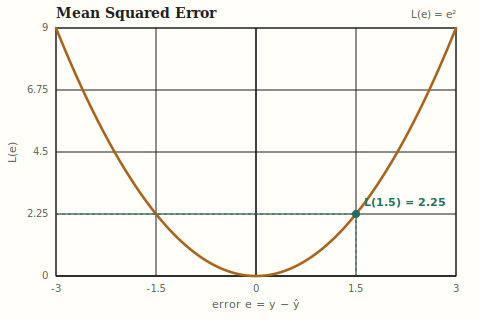
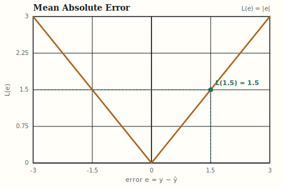
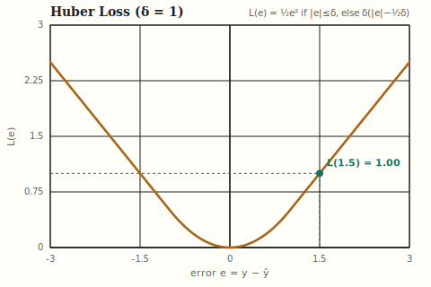
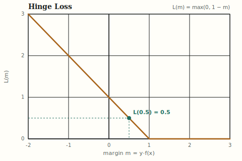
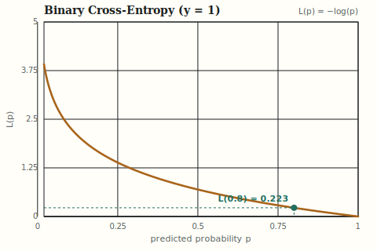
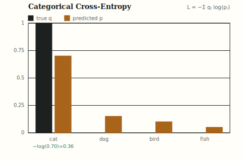
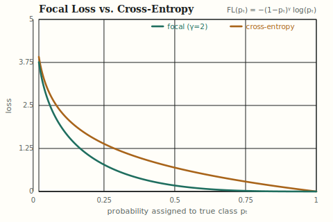
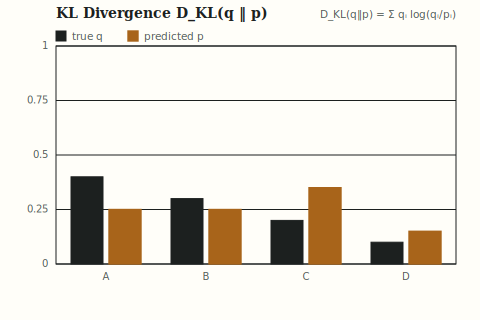
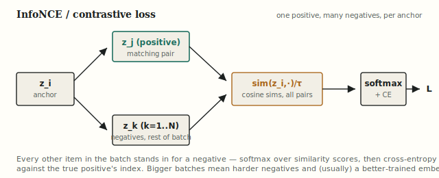
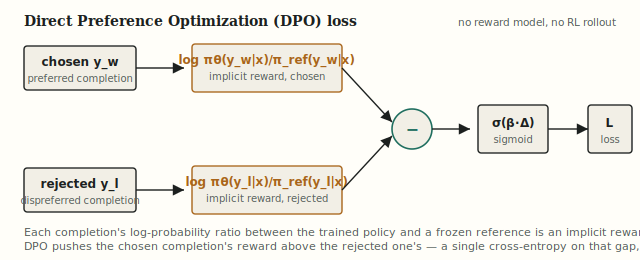

# Loss Functions, Demystified: From MSE to the Preference Losses Behind RLHF and GRPO

**Pull quotes:**
- "A model doesn't know it's wrong until you tell it how wrong — the loss function is the only voice in the room during training, and everything the network becomes is a reaction to what that voice rewards."
- "Cross-entropy didn't win as the default classification loss because it's intuitive. It won because its gradient is proportional to the error itself — the more confidently wrong a prediction is, the harder the correction pulls."
- "DPO and GRPO aren't new losses so much as an admission that a single scalar reward was never the point — what actually trains the model is the *comparison* between two of its own answers."

---

A loss function is the single number a network is trained to minimize — the translation of "how wrong was this prediction" into a differentiable signal that backpropagation can push through every weight in the network. This article works through what loss functions do, why the shape of that number matters as much as its value, and how the field moved from squared error through cross-entropy to the pairwise preference losses — DPO, GRPO — now used to post-train the LLMs behind ChatGPT, Claude, and every open-weight instruction-tuned model.

---

## Table of contents

1. [What are they?](#1-what-are-they)
2. [Where they live in training](#2-where-they-live-in-training)
3. [The functions in active use](#3-the-functions-in-active-use)
4. [Gradients and shapes, in numbers](#4-gradients-and-shapes-in-numbers)
5. [A runnable PyTorch comparison](#5-a-runnable-pytorch-comparison)
6. [What loss functions don't solve](#6-what-loss-functions-dont-solve)
7. [Summary table](#7-summary-table)
8. [Key takeaways](#8-key-takeaways)
9. [Further reading](#9-further-reading)

---

## 1. What are they?

A network doesn't learn from data. It learns from a number that says how badly it just failed on that data.

A loss function takes a prediction $\hat{y}$ and a target $y$ and returns a single scalar $L(\hat{y}, y)$ — lower is better, zero is perfect. Everything downstream depends on that scalar being differentiable, because training is nothing more than repeatedly asking "which direction, in weight-space, makes this number smaller":

$$\theta \leftarrow \theta - \eta \nabla_\theta L$$

The loss function is not incidental to what a model learns — it *is* what a model learns. Two networks with identical architecture, identical data, and identical optimizers will converge to meaningfully different behavior if trained on different losses, because the loss defines what "wrong" means. Penalize squared error and a model chases the mean; penalize absolute error and it chases the median; penalize a margin and it stops caring about correct predictions it's already confident about. The architecture decides what the network is *capable* of representing; the loss function decides what it actually optimizes for.

**Where the choice actually bites.** A regression loss and a classification loss are not interchangeable conveniences — they encode different assumptions about the data. Squared error assumes errors are roughly Gaussian and that large errors are disproportionately bad. Cross-entropy assumes the target is (or should be treated as) a probability distribution and penalizes confident wrongness far more than timid wrongness. Get the assumption wrong — using MSE on a classification problem, say — and the model trains, the loss goes down, and the resulting model is still worse than if the right loss had been chosen from the start.

---

## 2. Where they live in training

The loss function sits at the very end of the forward pass and the very start of the backward pass: predictions and targets go in, one scalar comes out, and that scalar's gradient is what actually flows backward through every layer.

```
input x  →  network  →  prediction ŷ  →  loss L(ŷ, y)  →  ∂L/∂ŷ  →  backprop through the network
                                              ↑
                                          target y
```

In a modern model pipeline, this single point in the diagram is where four genuinely different training regimes plug in the same mechanism with different scalars:

**Pretraining** uses categorical cross-entropy on next-token prediction — millions of tiny classification problems (predict the next token from a vocabulary of ~100k) chained across a sequence, averaged into one number per batch.

**Supervised fine-tuning (SFT)** uses the same cross-entropy, just on curated instruction-response pairs instead of raw web text — the loss function doesn't change, only the data distribution feeding it does.

**Contrastive / embedding pretraining** — CLIP, sentence embeddings, self-supervised vision models — uses InfoNCE instead of cross-entropy against a fixed label, because there often is no fixed label, only a notion of which pairs in a batch belong together.

**Preference-based post-training** — RLHF, DPO, GRPO — is where the loss function itself changes shape. Instead of scoring one prediction against one ground-truth target, these losses score *pairs* or *groups* of the model's own completions against each other, which is why they need their own section below rather than fitting the single-input-single-target pattern.

Two separate things ride on the choice of loss function, and it's worth keeping them distinct, the same way it mattered for activation functions.

**What "wrong" means.** The loss's shape determines which errors get penalized hardest. A quadratic loss punishes a large error far more than several small ones combined; an absolute-value loss treats them proportionally; a margin-based loss stops punishing errors once they're "far enough" correct. This shape decides what the trained model will actually prioritize getting right.

**Gradient behavior.** Just as an activation function's derivative multiplies through backprop, the loss function's derivative *starts* that chain. A loss whose gradient vanishes near its optimum (like squared error near zero) gives fine-grained corrections as training converges; a loss whose gradient is constant everywhere it's active (like absolute error or hinge loss) gives the same-size push regardless of how close the prediction already is — a genuinely different training dynamic, not just a different number.

---

## 3. The functions in active use

Eleven loss functions, three eras: the regression classics, the classification workhorses that still run inside every LLM's pretraining loop, and the comparative losses — contrastive, preference-based — that now do most of the work in representation learning and post-training.

### Mean Squared Error *(L2 loss, statistics-era–present)*

**Intuition first.** Take the gap between prediction and target, square it. Squaring does two things at once: it makes every error positive (so a $+2$ error and a $-2$ error don't cancel when averaged), and it makes large errors count disproportionately more than small ones — being off by 4 is sixteen times worse than being off by 1, not four times worse.

$$\text{MSE}(e) = e^2, \qquad e = y - \hat{y}$$



The shape is a parabola: zero at $e=0$, growing quadratically in both directions, perfectly symmetric. Its derivative $\frac{d}{de}(e^2) = 2e$ is proportional to the error itself — a huge error produces a huge gradient, a tiny error produces a tiny gradient, so the correction naturally shrinks as the prediction approaches the target. That smooth deceleration into the optimum is MSE's biggest practical strength; its biggest practical weakness is the same squaring — a handful of outliers can dominate the entire loss and drag the model toward accommodating them at the expense of everything else.

**Worked example.** Take a target $y = 5$ and prediction $\hat{y} = 3.5$, so $e = 1.5$:

$$\text{MSE}(1.5) = 1.5^2 = 2.25$$

Compare a smaller miss, $e = 0.5$: $\text{MSE}(0.5) = 0.25$ — a $3\times$ larger error produces a $9\times$ larger loss, the signature of the quadratic shape.

### Mean Absolute Error *(L1 loss, statistics-era–present)*

**Intuition first.** The blunter sibling of MSE: instead of squaring the error, just take its absolute value. Every unit of error costs exactly one unit of loss, no matter how large or small the error already is — there's no premium on big misses and no discount on small ones.

$$\text{MAE}(e) = |e|, \qquad e = y - \hat{y}$$



The shape is a V: two straight lines meeting at a sharp corner at $e=0$. Unlike MSE's parabola, the slope is constant at $\pm 1$ everywhere except that corner — the gradient doesn't shrink as the prediction approaches the target, which means training doesn't naturally decelerate near convergence the way it does under MSE. The payoff for that bluntness is robustness: because MAE doesn't square the error, a handful of extreme outliers can't dominate the loss the way they can under MSE, which is why MAE (and the model statistic it corresponds to, the median) is the standard choice when a dataset is known to contain heavy-tailed noise.

**Worked example.** Same target and prediction as the MSE example, $e = 1.5$:

$$\text{MAE}(1.5) = |1.5| = 1.5$$

Where MSE gave $2.25$ for this error, MAE gives $1.5$ — and critically, MAE's gradient at $e=1.5$ and at $e=15$ is identical ($\pm 1$), while MSE's gradient at those two points differs by a factor of ten.

### Huber Loss *(1964, adopted widely 2010s–present)*

**Intuition first.** A deliberate compromise: behave like MSE — smooth, quadratic, gradient that shrinks near the optimum — for small errors, but switch to behaving like MAE — linear, constant gradient, outlier-resistant — once the error crosses a threshold $\delta$. It's the loss function equivalent of "be precise about small mistakes, be robust about large ones."

$$\text{Huber}_\delta(e) = \begin{cases} \frac{1}{2}e^2 & |e| \le \delta \\ \delta\left(|e| - \frac{1}{2}\delta\right) & |e| > \delta \end{cases}$$



The shape tracks MSE's parabola near the origin, then smoothly transitions into two straight lines with slope $\pm\delta$ once $|e|$ exceeds the threshold — visually almost indistinguishable from MSE close to zero, and almost indistinguishable from a scaled MAE far from zero. The transition point is continuous and differentiable (no kink, unlike ReLU or MAE), which matters for optimizers that rely on gradient smoothness. $\delta$ becomes a genuine hyperparameter: small $\delta$ makes the loss behave mostly like MAE (robust but slower to fine-tune near convergence); large $\delta$ makes it behave mostly like MSE (precise but outlier-sensitive).

**Worked example.** Take $\delta = 1$ and the same $e = 1.5$ used above — this now falls in the *linear* regime since $|1.5| > 1$:

$$\text{Huber}_1(1.5) = 1 \times \left(1.5 - \frac{1}{2}\right) = 1.00$$

Compare a smaller error inside the quadratic regime, $e = 0.5$: $\text{Huber}_1(0.5) = \frac{1}{2}(0.5)^2 = 0.125$, matching MSE exactly at that point since $|0.5| \le \delta$.

### Hinge Loss *(SVM-era, 1990s–present)*

**Intuition first.** Hinge loss doesn't ask "how close is the prediction to the target" — it asks "is the prediction correct by a comfortable margin." A binary classifier with target $y \in \{-1, +1\}$ and raw score $f(x)$ is scored on the margin $m = y \cdot f(x)$: positive and large means confidently correct, negative means wrong. Hinge loss charges nothing once that margin clears a threshold of 1, and charges linearly for every unit short of it.

$$\text{Hinge}(m) = \max(0,\ 1 - m), \qquad m = y \cdot f(x)$$



The shape is flat at exactly zero for any $m \ge 1$, then a straight line of slope $-1$ for $m < 1$ — a hinge, literally. This is a fundamentally different philosophy from MSE or cross-entropy: those losses keep pushing a correct prediction to become *more* correct forever (their gradient never hits exactly zero), while hinge loss stops caring the instant a prediction is "correct enough," directing all remaining gradient toward the genuinely wrong or marginal examples. That's precisely the property that gives support vector machines their name — the "support vectors" are exactly the points sitting inside or on the margin, since every other point contributes zero gradient.

**Worked example.** Take a correctly-classified but under-confident example, $y = 1$ and $f(x) = 0.5$, so $m = 0.5$:

$$\text{Hinge}(0.5) = \max(0,\ 1 - 0.5) = 0.5$$

Now take a confidently correct example, $m = 2$: $\text{Hinge}(2) = \max(0, -1) = 0$ — no loss at all, and no gradient, even though the model could in principle push the score even higher.

### Binary Cross-Entropy *(log loss, 1940s information theory → 2010s deep learning default)*

**Intuition first.** For a target $y \in \{0, 1\}$ and a predicted probability $p \in (0,1)$, binary cross-entropy charges $-\log(p)$ when the true label is 1 and $-\log(1-p)$ when it's 0 — in both cases, the loss is the negative log-probability the model assigned to the *actual* outcome. A confident correct prediction costs almost nothing; a confident wrong prediction costs enormously, because $-\log(p)$ diverges to infinity as $p \to 0$.

$$\text{BCE}(y, p) = -\big[y \log p + (1-y)\log(1-p)\big]$$



The plot above shows the $y=1$ case in isolation: $L(p) = -\log(p)$, flat near zero for $p$ close to 1, then curving sharply upward and shooting to infinity as $p \to 0$. That asymmetry — barely any penalty for confident correctness, unbounded penalty for confident wrongness — is the entire point of using a log rather than, say, $(1-p)^2$: it forces a model to never be *completely* certain about anything, because total certainty in the wrong direction is infinitely costly. The gradient with respect to the model's raw logit $z$ (before the sigmoid) reduces to the remarkably simple $p - y$ — the error itself, no extra scaling — which is why cross-entropy paired with a sigmoid or softmax output is close to the best-behaved combination available for classification.

**Worked example.** Take $y=1$ and a fairly confident correct prediction, $p = 0.8$:

$$\text{BCE}(1, 0.8) = -\log(0.8) = 0.223$$

Compare a fairly confident *wrong* prediction, $p = 0.2$ for the same $y=1$: $\text{BCE}(1, 0.2) = -\log(0.2) = 1.609$ — roughly seven times the loss for a symmetric-looking mistake, because the log punishes confident wrongness far harder than it rewards confident correctness.

### Categorical Cross-Entropy *(softmax + log loss, the LLM pretraining workhorse)*

**Intuition first.** The multi-class generalization of BCE, and the single most-run loss function in modern AI: it's what every LLM optimizes, token by token, hundreds of billions of times, during pretraining. Given a true (usually one-hot) distribution $q$ over classes and a predicted distribution $p$ (the output of a softmax), the loss is just the negative log-probability the model assigned to the correct class.

$$\text{CE}(q, p) = -\sum_i q_i \log p_i \;\;\xrightarrow{\text{one-hot } q}\;\; -\log p_{\text{true class}}$$



When $q$ is one-hot — exactly one class has probability 1, the rest have probability 0 — every term in the sum except the true class vanishes, and the formula collapses to exactly BCE's shape: $-\log$ of whatever probability the model assigned to the right answer. This is the mechanism inside every "predict the next token" step of LLM pretraining: the vocabulary (often 100k+ tokens) stands in for "classes," the softmax over logits stands in for $p$, and the actual next token in the training text stands in for the one-hot $q$. Cross-entropy's log-scale penalty on confident wrongness is a large part of why LLMs trained on it become well-calibrated next-token predictors rather than models that hedge uniformly across the vocabulary.

**Worked example.** Take the 4-class diagram above: the true class is "cat" (one-hot), and the model's softmax output is $p = [0.70,\ 0.15,\ 0.10,\ 0.05]$ over $[\text{cat}, \text{dog}, \text{bird}, \text{fish}]$:

$$\text{CE}(q, p) = -\log(0.70) = 0.357$$

Only the probability mass the model put on the *correct* class matters — the 0.15, 0.10, and 0.05 assigned to the wrong classes never enter the calculation directly, though they mattered during the softmax normalization that produced 0.70 in the first place.

**A short aside — perplexity.** The number every LLM leaderboard actually quotes isn't cross-entropy directly, it's *perplexity*: $\text{PPL} = e^{\text{CE}}$, the exponential of the average cross-entropy loss over a sequence. It's the same quantity, just rescaled to read as "the model was, on average, as uncertain as if it were choosing uniformly among this many tokens." A perplexity of 1 is a perfect, fully confident model; a perplexity equal to the vocabulary size is a model that has learned nothing and is guessing uniformly. Perplexity is an evaluation metric, not a training loss — the model is still trained by minimizing cross-entropy directly — but it's worth naming here since it's cross-entropy's number in a more legible unit.

### Focal Loss *(2017–present, class-imbalance fix to cross-entropy)*

**Intuition first.** Cross-entropy treats every example's contribution to the loss the same way regardless of how easy it already is — a well-classified example with $p_t = 0.95$ still contributes some gradient. In a dataset dominated by easy negatives (as in object detection, where most of an image is easy-to-classify background and only a few pixels are the hard, rare object), that steady trickle from thousands of easy examples can swamp the signal from the few hard ones. Focal loss adds a modulating factor that down-weights easy, well-classified examples so training spends its gradient budget on the examples the model is actually still getting wrong.

$$\text{FL}(p_t) = -(1-p_t)^\gamma \log(p_t)$$

where $p_t$ is the probability the model assigned to the *true* class (matching the notation from the cross-entropy section above) and $\gamma \ge 0$ is a tunable focusing parameter — $\gamma = 0$ recovers plain cross-entropy exactly.



The two curves overlap almost completely for small $p_t$ (hard examples) but diverge sharply as $p_t \to 1$: cross-entropy still charges a small but nonzero loss for a confidently correct prediction, while focal loss's $(1-p_t)^\gamma$ term crushes that same loss toward zero. The bigger $\gamma$ is, the more aggressively easy examples get suppressed — $\gamma=2$ is the value used in the original RetinaNet paper and remains the most common default. This is a targeted fix for a specific failure mode (class imbalance), the same way Huber loss was a targeted fix for MSE's outlier sensitivity — not a universal replacement for cross-entropy, since on a balanced dataset the two behave nearly identically.

**Worked example.** Take $\gamma = 2$ and compare an easy example ($p_t = 0.9$) against a hard one ($p_t = 0.1$):

$$\text{FL}(0.9) = -(1-0.9)^2 \log(0.9) = -(0.01)(-0.105) = 0.0011$$

$$\text{FL}(0.1) = -(1-0.1)^2 \log(0.1) = -(0.81)(-2.303) = 1.865$$

Plain cross-entropy on the same two points gives $0.105$ and $2.303$ respectively — focal loss barely touches the hard example's loss (1.865 vs. 2.303) but crushes the easy example's loss by nearly 100$\times$ (0.0011 vs. 0.105), which is exactly the redistribution of gradient the loss was designed to produce.

### KL Divergence *(Kullback–Leibler, 1951 information theory → distillation, RLHF)*

**Intuition first.** Where cross-entropy measures how well a predicted distribution $p$ matches a target that's usually a hard one-hot label, KL divergence measures the gap between two full probability distributions — how many extra "bits of surprise" you pay, on average, for using $p$ to describe outcomes that actually follow $q$. It shows up wherever a model needs to stay close to another model's distribution rather than to a single correct answer.

$$D_{KL}(q \,\|\, p) = \sum_i q_i \log\frac{q_i}{p_i} = \underbrace{\left(-\sum_i q_i \log p_i\right)}_{\text{cross-entropy}} - \underbrace{\left(-\sum_i q_i \log q_i\right)}_{\text{entropy of } q}$$



The identity above is the important structural fact: KL divergence is cross-entropy minus $q$'s own entropy. When $q$ is one-hot, its entropy is exactly zero, and $D_{KL}(q\|p)$ collapses to plain cross-entropy — which is why categorical cross-entropy against one-hot labels can be read as "KL divergence in the special case where the target has no uncertainty of its own." When $q$ is *not* one-hot — a soft label, a teacher model's output distribution, a reference policy's token distribution — the entropy term stops being a constant and KL diverges from cross-entropy in a way that actually matters. This is why KL, not cross-entropy, is the standard loss for knowledge distillation (matching a small model's outputs to a large teacher's full distribution) and why it appears as a regularization term in RLHF, keeping a fine-tuned policy from drifting too far from its reference model. One asymmetry worth flagging: $D_{KL}(q\|p) \ne D_{KL}(p\|q)$ in general — it is a divergence, not a distance, and which distribution plays the role of $q$ versus $p$ changes what the penalty means.

**Worked example.** Take the two distributions in the diagram, $q = [0.40, 0.30, 0.20, 0.10]$ and $p = [0.25, 0.25, 0.35, 0.15]$:

$$D_{KL}(q\|p) = 0.40\log\frac{0.40}{0.25} + 0.30\log\frac{0.30}{0.25} + 0.20\log\frac{0.20}{0.35} + 0.10\log\frac{0.10}{0.15} = 0.0902$$

A small but nonzero number — the two distributions put probability mass in similar places (both peak around categories A/B and C), so the divergence is modest rather than large.

### The comparative losses: InfoNCE, DPO, and GRPO

Every function above scores one prediction against one fixed target. The losses in this final group are built around a different question entirely: not "how close is this output to the right answer," but "how does this output compare to the other candidates it's being judged against" — other items in a batch for InfoNCE, a rejected completion for DPO, a group of sampled completions for GRPO.

#### InfoNCE *(contrastive / noise-contrastive estimation, 2018–present)*

**Intuition first.** Representation-learning models (CLIP matching images to captions, sentence-embedding models, self-supervised vision models) often have no single "correct output" to regress or classify against — the training signal is instead "this image and this caption *belong together*, and this image and every *other* caption in the batch do not." InfoNCE turns that into a classification problem in disguise: treat the one true match as the correct class and every other item in the batch as a wrong class, then run ordinary categorical cross-entropy over similarity scores instead of network logits.

$$\mathcal{L}_{\text{InfoNCE}} = -\log \frac{\exp(\text{sim}(z_i, z_j)/\tau)}{\sum_{k=1}^{N} \exp(\text{sim}(z_i, z_k)/\tau)}$$



Structurally this *is* categorical cross-entropy from earlier in this article — $\text{sim}(z_i,\cdot)/\tau$ plays the role of the logits, softmax turns them into a probability distribution over "which of these $N$ items is the true match," and the loss is $-\log$ of the probability assigned to the correct one. What's new is where the logits come from: not a learned classification head, but the cosine similarity between two learned embeddings, scaled by a temperature $\tau$ that controls how sharply the softmax distinguishes close negatives from far ones. Because every other example in the batch supplies a free negative, InfoNCE's quality scales with batch size in a way ordinary cross-entropy doesn't — CLIP and similar contrastive-pretraining setups are trained with batch sizes in the tens of thousands specifically because more negatives per anchor makes the comparison harder and the resulting embedding space more discriminative.

**Worked example.** Take an anchor with cosine similarities to one positive and three negatives, $\text{sim} = [0.9\ (\text{positive}),\ 0.2,\ 0.1,\ -0.3]$, and $\tau = 0.1$:

$$\text{sim}/\tau = [9.0,\ 2.0,\ 1.0,\ -3.0]$$

$$\text{softmax} = [0.9987,\ 0.00091,\ 0.00034,\ 0.0000061]$$

$$\mathcal{L}_{\text{InfoNCE}} = -\log(0.9987) = 0.0013$$

A small temperature makes the softmax sharply confident once the positive's similarity is clearly the highest — but drop the positive's similarity to $0.3$ (still the largest, just less dominant) and the loss climbs to $0.409$, showing how sensitive the low-temperature softmax is to the *margin* between the positive and the best negative, not just which one wins.

### The preference losses: DPO and GRPO

The two losses below share InfoNCE's comparative structure but apply it to an LLM's own generated completions rather than to a batch of embeddings — not "how close is this output to the right answer" (there often isn't a single right answer for "write a helpful response"), but "does the model prefer the *better* of two of its own candidate outputs."



This is the shape shared by RLHF's reward-model objective, **DPO** (Direct Preference Optimization), and **GRPO** (Group Relative Policy Optimization) — the algorithm behind DeepSeek-R1 and covered in more depth in [this repo's GRPO notes](grpo-llm-post-training.md). What names the variant is *how* the comparison is structured: DPO compares exactly two completions per prompt (chosen vs. rejected); GRPO compares a whole group of sampled completions against their own group-average reward.

#### DPO *(Direct Preference Optimization, 2023–present)*

**Intuition first.** Classic RLHF trains a separate reward model, then uses reinforcement learning (PPO) to push the policy toward outputs that reward model scores highly — two training stages, an RL loop, and all the instability that comes with it. DPO's insight was that the reward model can be eliminated entirely: the *policy itself*, compared against a frozen reference copy of itself, already implicitly defines a reward. Train directly on pairs of (chosen, rejected) completions with a single cross-entropy-shaped loss, and skip the RL loop altogether.

$$\mathcal{L}_{\text{DPO}} = -\log \sigma\!\left(\beta \left[\log\frac{\pi_\theta(y_w|x)}{\pi_{\text{ref}}(y_w|x)} - \log\frac{\pi_\theta(y_l|x)}{\pi_{\text{ref}}(y_l|x)}\right]\right)$$

Structurally this is binary cross-entropy wearing a different outfit: the term inside $\sigma(\cdot)$ is a *margin* — how much more the policy prefers the chosen response $y_w$ over the rejected response $y_l$, relative to how the frozen reference model would have scored the same pair — and $-\log\sigma(\cdot)$ is exactly the BCE shape from earlier in this article, applied to that margin instead of to a raw probability. $\beta$ controls how sharply the loss penalizes a policy that hasn't yet separated the two completions; a larger $\beta$ demands a bigger preference gap before the loss gets small. Because the reference model appears only as a fixed comparison point (never updated, never sampled from during training), DPO needs no reward model and no RL rollouts — just two forward passes and a loss that looks almost exactly like the classification losses covered earlier.

**Worked example.** Take $\beta = 0.1$, and suppose the policy assigns the chosen response a $4.0$ nat-higher log-probability advantage over the reference (i.e., $\log\frac{\pi_\theta(y_w)}{\pi_{\text{ref}}(y_w)} - \log\frac{\pi_\theta(y_l)}{\pi_{\text{ref}}(y_l)} = 4.0$) — a large step the wrong direction from what the reference model would have "preferred":

$$\mathcal{L}_{\text{DPO}} = -\log \sigma(0.1 \times 4.0) = -\log \sigma(0.4) = -\log(0.599) = 0.513$$

Compare a policy that has learned to strongly separate the pair, margin $= 20$: $-\log\sigma(2.0) = -\log(0.881) = 0.127$ — a much smaller loss, the same asymptotic behavior BCE showed earlier as $p \to 1$.

#### GRPO *(Group Relative Policy Optimization, 2024–present)*

**Intuition first.** DPO compares exactly two completions. GRPO, developed for DeepSeek's models and used heavily in reasoning-focused post-training, samples a whole *group* of completions for the same prompt, scores each with a reward function (often a simple correctness check for math or code, not a learned reward model), and trains each completion to move toward or away from the policy in proportion to how far its reward sits from the group's own average — no separate value network needed, unlike PPO.

$$A_i = \frac{r_i - \text{mean}(r_1, \dots, r_G)}{\text{std}(r_1, \dots, r_G)}, \qquad \mathcal{L}_{\text{GRPO}} = -\mathbb{E}_i\left[\min\!\Big(\rho_i A_i,\ \text{clip}(\rho_i, 1{-}\epsilon, 1{+}\epsilon)A_i\Big)\right] + \beta\, D_{KL}(\pi_\theta \,\|\, \pi_{\text{ref}})$$

where $\rho_i$ is the policy-vs-old-policy probability ratio for completion $i$, structurally identical to PPO's clipped surrogate objective. The group itself is what replaces the learned value function: instead of a separate network predicting "how good is this state," the *group's own mean reward* is the baseline every completion is measured against — cheaper to compute, and specifically well-suited to domains like math and code where a reward is easy to check (did the proof verify, did the tests pass) but expensive to model with a learned network. Note the KL term at the end: it's exactly the KL divergence covered earlier in this article, here regularizing the policy back toward the reference model so it doesn't drift into degenerate high-reward-but-incoherent outputs.

**Worked example.** Take a group of $G=4$ sampled completions for one math problem, with binary correctness rewards $r = [1, 0, 1, 0]$ (two solved it, two didn't):

$$\text{mean}(r) = 0.5, \qquad \text{std}(r) = 0.5$$

$$A = \left[\frac{1-0.5}{0.5},\ \frac{0-0.5}{0.5},\ \frac{1-0.5}{0.5},\ \frac{0-0.5}{0.5}\right] = [1,\ -1,\ 1,\ -1]$$

The two correct completions get pushed toward (positive advantage), the two incorrect ones get pushed away (negative advantage) — entirely from the group's own spread, with no external value network estimating what "0.5 reward" should have been worth.

### Use cases at a glance

*Condensed from the "used in" context above.*

| Function | Primary use case | Example models / pipelines |
|---|---|---|
| MSE | Regression, pixel-level reconstruction losses | Autoencoders, image regression, classic regression models |
| MAE | Regression with outlier-heavy data | Robust regression, some time-series forecasting |
| Huber | Regression needing both precision and outlier robustness | Object-detection bounding-box regression (Faster R-CNN, YOLO) |
| Hinge | Margin-based binary classification | SVMs; margin losses in some GAN discriminators |
| Binary Cross-Entropy | Binary / multi-label classification | Logistic regression, binary classifiers, sigmoid output heads |
| Categorical Cross-Entropy | Multi-class classification; LLM next-token prediction | Every LLM's pretraining loop (GPT, Llama, Qwen, etc.), image classifiers |
| Focal Loss | Classification under severe class imbalance | RetinaNet and other single-stage object detectors |
| KL Divergence | Distillation; RLHF policy regularization | Knowledge distillation, RLHF reward/policy penalty, VAEs |
| InfoNCE | Contrastive representation / embedding learning | CLIP, SimCLR, sentence-embedding models |
| DPO | Preference-based post-training without a reward model | Llama 3, Zephyr, many open-weight instruction-tuned models |
| GRPO | Group-relative reasoning post-training | DeepSeek-R1, DeepSeekMath |

### Pros and cons at a glance

*Condensed from the bullet lists above, for quick side-by-side scanning.*

| Function | Pros | Cons |
|---|---|---|
| MSE | Smooth, differentiable everywhere; gradient shrinks near optimum; well-understood statistics | Outlier-sensitive — a few large errors dominate the loss |
| MAE | Robust to outliers; constant gradient magnitude | Non-differentiable at zero; gradient doesn't shrink near convergence |
| Huber | Combines MSE's smoothness with MAE's robustness | Extra hyperparameter δ to tune; behavior straddles two regimes |
| Hinge | Stops penalizing already-confident correct predictions; sparse "support vector" gradients | Not probabilistic — no calibrated confidence output; non-differentiable at the hinge |
| Binary Cross-Entropy | Probabilistic, well-calibrated; clean gradient (p−y) with sigmoid | Diverges to infinity for confidently wrong predictions on noisy labels |
| Categorical Cross-Entropy | Standard, well-understood, pairs naturally with softmax | Only penalizes probability on the true class; can encourage overconfidence without label smoothing |
| Focal Loss | Rebalances gradient toward hard examples; one extra scalar (γ) over cross-entropy | γ is a tuned hyperparameter; little benefit on already-balanced datasets |
| KL Divergence | Captures full-distribution mismatch, not just one class; principled information-theoretic basis | Asymmetric (order of arguments matters); undefined where p is 0 but q isn't |
| InfoNCE | No labels needed — learns from structure of the data itself; scales with batch size | Needs large batches (many negatives) to work well; temperature τ is a sensitive hyperparameter |
| DPO | No reward model or RL loop needed; stable, single-stage training | Needs paired preference data; quality bounded by the reference model and the pairs collected |
| GRPO | No value network; well-suited to verifiable rewards (math, code) | Needs multiple samples per prompt (higher inference cost during training); reward signal can be sparse |

---

## 4. Gradients and shapes, in numbers

Two examples worth sitting with — why MSE and MAE disagree sharply on outliers, and how cross-entropy's gradient compares to squared error's near a wrong prediction.

### Example 1 — Why MSE and MAE Diverge on Outliers

This is the outlier-sensitivity difference in actual numbers, not just as a name.

**Setup:** four prediction errors from a batch — three small ($e=0.5$) and one large outlier ($e=8$), as might happen if one label in a batch is corrupted.

```
Error (e)    MSE contribution (e²)    MAE contribution (|e|)
──────────────────────────────────────────────────────────
0.5          0.25                     0.5
0.5          0.25                     0.5
0.5          0.25                     0.5
8.0          64.00                    8.0
──────────────────────────────────────────────────────────
Mean         16.19                    2.375
```

Under MSE, the single outlier contributes 64 out of a total of 64.75 — **98.8% of the entire loss** comes from one bad example, and the gradient computed from this batch will be dominated almost entirely by pushing the model to accommodate that one point. Under MAE, the outlier contributes 8 out of 9.5 — still the largest single contributor, but only 84%, and critically its *gradient* contribution (constant magnitude 1, same as every other point) doesn't scale with how extreme the error is. This is the entire practical case for MAE (or Huber) over MSE whenever a dataset is known to contain label noise or extreme outliers: MSE doesn't just weight the outlier more in the loss value, it weights it more in the gradient that actually updates the weights.

### Example 2 — Cross-Entropy's Gradient vs. Squared Error's, on the Same Wrong Prediction

Both losses can, in principle, be used on a classification problem's raw probability output. The reason cross-entropy is preferred is visible directly in the gradient magnitude at a *confidently wrong* prediction.

**Setup:** true label $y=1$, model outputs $p = 0.01$ — badly, confidently wrong.

```
Loss                Value                    Gradient w.r.t. p
──────────────────────────────────────────────────────────────
MSE  (y-p)²          (1-0.01)² = 0.980       -2(y-p) = -1.980
BCE  -log(p)          -log(0.01) = 4.605     -y/p = -100.0
```

At this single point, cross-entropy's gradient is **roughly 50 times larger** than squared error's. That's not a coincidence — MSE's gradient with respect to $p$ is linear in the error ($-2(y-p)$), while BCE's gradient blows up as $p \to 0$ ($-y/p$). Practically, this means a model trained with cross-entropy gets a dramatically stronger corrective push exactly when it's most badly wrong, while a model trained with MSE on the same confidently-wrong prediction gets barely more gradient signal than it would for a moderately wrong one. This is the numeric reason cross-entropy, not squared error, is the standard loss for classification.

---

## 5. A runnable PyTorch comparison

The snippet below applies every loss covered above to the same sample predictions and targets, so the numbers can be compared directly. `nn.MSELoss`, `nn.L1Loss`, `nn.HuberLoss`, `nn.HingeEmbeddingLoss`, `nn.BCELoss`, `nn.CrossEntropyLoss`, and `nn.KLDivLoss` all ship in PyTorch directly; focal loss, InfoNCE, and DPO are shown as the small functions they actually are on top of those primitives.

```python
import torch
import torch.nn as nn
import torch.nn.functional as F

# --- regression losses ---
y_true = torch.tensor([5.0, 2.0, 9.0])
y_pred = torch.tensor([3.5, 2.3, 0.5])  # last one is a deliberate outlier

print("MSE:  ", nn.MSELoss()(y_pred, y_true).item())
print("MAE:  ", nn.L1Loss()(y_pred, y_true).item())
print("Huber:", nn.HuberLoss(delta=1.0)(y_pred, y_true).item())

# --- classification losses ---
logits = torch.tensor([[2.0, 0.5, 0.1, -1.0]])   # raw scores, 4 classes
target_class = torch.tensor([0])                  # true class index 0
probs = F.softmax(logits, dim=-1)

print("Categorical CE:", nn.CrossEntropyLoss()(logits, target_class).item())
print("-log(p_true):  ", -torch.log(probs[0, 0]).item())  # should match

p_true, q_true = F.softmax(torch.tensor([[2.0, 1.0, 0.1]]), dim=-1), \
                  F.softmax(torch.tensor([[1.5, 1.2, 0.3]]), dim=-1)
print("KL(q || p):", F.kl_div(p_true.log(), q_true, reduction="batchmean").item())

# --- focal loss: reweight cross-entropy by (1 - p_t)^gamma ---
def focal_loss(logits, target, gamma=2.0):
    ce = F.cross_entropy(logits, target, reduction="none")
    p_t = torch.exp(-ce)
    return ((1 - p_t) ** gamma * ce).mean()

print("Focal loss:", focal_loss(logits, target_class).item())

# --- InfoNCE: cross-entropy over cosine similarities instead of network logits ---
def info_nce(anchor, positive, negatives, tau=0.1):
    candidates = torch.cat([positive.unsqueeze(0), negatives], dim=0)  # [1+N, d]
    sims = F.cosine_similarity(anchor.unsqueeze(0), candidates, dim=-1) / tau
    return F.cross_entropy(sims.unsqueeze(0), torch.tensor([0]))  # index 0 = positive

anchor = torch.tensor([1.0, 0.0])
positive = torch.tensor([0.9, 0.1])
negatives = torch.stack([torch.tensor([0.1, 0.9]), torch.tensor([-1.0, 0.2])])
print("InfoNCE:", info_nce(anchor, positive, negatives).item())

# --- DPO loss, as it's actually computed on top of a policy and a reference model ---
def dpo_loss(policy_chosen_logp, policy_rejected_logp,
             ref_chosen_logp, ref_rejected_logp, beta=0.1):
    policy_margin = policy_chosen_logp - policy_rejected_logp
    ref_margin = ref_chosen_logp - ref_rejected_logp
    return -F.logsigmoid(beta * (policy_margin - ref_margin))

loss = dpo_loss(
    policy_chosen_logp=torch.tensor(-12.0), policy_rejected_logp=torch.tensor(-18.0),
    ref_chosen_logp=torch.tensor(-14.0), ref_rejected_logp=torch.tensor(-14.0),
)
print("DPO loss:", loss.item())
```

Running this makes the shapes concrete: MSE's mean is dragged upward by the single outlier in a way MAE's isn't; the manually computed `-log(p_true)` matches PyTorch's built-in `CrossEntropyLoss` exactly, confirming the softmax-plus-log-loss equivalence described in Section 3; `focal_loss` and `info_nce` both reduce to a couple of lines wrapped around `F.cross_entropy`, underscoring that neither is a new primitive so much as cross-entropy pointed at a different input; and the DPO loss reduces to a single `logsigmoid` call on a margin computed from four scalar log-probabilities — no reward model, no rollout, in the code.

---

## 6. What loss functions don't solve

Objectivity requires noting that no loss function is a complete fix, and picking a better one does not make other training problems disappear.

**They don't fix a bad reward or bad labels.** Cross-entropy trained against mislabeled data will confidently learn the wrong thing just as readily as it learns the right thing — the loss function optimizes whatever target it's given, correct or not. DPO and GRPO inherit this even more sharply: a DPO model is only as good as the preference pairs it was trained on, and a GRPO model is only as good as its reward function actually being a proxy for "good" (a reward hackable by a clever policy will get hacked).

**Lower loss is not automatically a better model.** A model can drive training loss down by memorizing noise, overfitting to a narrow data distribution, or (in RLHF-adjacent settings) exploiting a flaw in the reward signal — "reward hacking" is a loss-function problem dressed up as a policy problem. The number going down is necessary but not sufficient evidence of the model actually improving at the task anyone cares about.

**Loss choice doesn't replace regularization or good data.** Huber loss reduces outlier sensitivity, but it doesn't fix a dataset where 20% of labels are simply wrong — that's a data problem, and no amount of loss-function engineering substitutes for cleaning the data or adding an explicit regularization term.

**Preference losses don't eliminate the need for a good policy to start from.** DPO and GRPO both assume a reasonably capable base/SFT model to begin with — they sharpen an existing distribution of behaviors toward what's preferred or rewarded, but neither invents capabilities the base model didn't already have some probability of producing.

**The "right" choice keeps moving.** Cross-entropy looked settled as the classification standard for a decade; RLHF's PPO-based pipeline looked settled as the post-training standard until DPO's 2023 paper showed the reward model and RL loop were both eliminable; DPO itself is now one of several competing preference losses (IPO, KTO, ORPO, GRPO) rather than an uncontested endpoint. Treat every "modern LLMs use X" claim in this article as a snapshot of current practice, not a law of nature.

---

## 7. Summary table

*Formulas below are compressed to fit a table row — see [Section 3](#3-the-functions-in-active-use) for each one written out on its own line, with a worked example.*

| Function | Formula | Typical use | Key tradeoff |
|---|---|---|---|
| MSE | $e^2$ | Regression | Smooth, but outlier-dominated |
| MAE | $\lvert e\rvert$ | Robust regression | Outlier-resistant, non-smooth at 0 |
| Huber | quadratic near 0, linear past δ | Bounding-box / robust regression | Best of both, needs tuned δ |
| Hinge | $\max(0, 1-m)$ | Margin classifiers, SVMs | Sparse gradient, no calibrated probability |
| Binary Cross-Entropy | $-[y\log p+(1{-}y)\log(1{-}p)]$ | Binary classification | Clean gradient, diverges on noisy labels |
| Categorical Cross-Entropy | $-\sum_i q_i\log p_i$ | LLM next-token prediction, multi-class | Standard, but only scores the true class |
| Focal Loss | $-(1-p_t)^\gamma\log p_t$ | Imbalanced classification, object detection | Suppresses easy examples, adds tuned γ |
| KL Divergence | $\sum_i q_i\log(q_i/p_i)$ | Distillation, RLHF regularization | Full-distribution, but asymmetric |
| InfoNCE | $-\log\frac{\exp(\text{sim}_{ij}/\tau)}{\sum_k\exp(\text{sim}_{ik}/\tau)}$ | Contrastive embedding learning | Label-free, but needs large batches |
| DPO | $-\log\sigma(\beta[\Delta_\theta-\Delta_{\text{ref}}])$ | Preference post-training | No reward model, needs paired data |
| GRPO | clipped ratio × group-normalized advantage + KL | Reasoning post-training | No value network, needs sampled groups |

---

## 8. Key takeaways

- **The loss function defines what "wrong" means, not just how wrong.** MSE, MAE, and Huber all measure the same residual but produce meaningfully different trained models because they weight large versus small errors differently.
- **The field moved from single-target losses to distributional losses to comparative losses.** MSE/MAE score a prediction against one number; cross-entropy/KL score a distribution against a target distribution; InfoNCE/DPO/GRPO score one of the model's own outputs against others — each step needed a genuinely different kind of training signal, not just a better curve.
- **Cross-entropy dominates LLM training because its gradient scales with confidence, not just error.** A confidently wrong prediction gets a dramatically larger corrective gradient than a mildly wrong one — squared error doesn't do this nearly as sharply, which is why cross-entropy, not MSE, trains every major LLM's next-token prediction.
- **Focal loss and InfoNCE both modify what cross-entropy is computed over, not the underlying mechanism.** Focal loss reweights cross-entropy's terms by how easy each example already is; InfoNCE runs cross-entropy over similarity scores instead of network logits, turning "which embedding matches" into an ordinary classification problem.
- **DPO and GRPO removed the reward model and the RL loop from post-training, not the underlying idea.** Both still optimize a policy toward higher-reward behavior; they just compute that signal directly from comparisons (pairs for DPO, groups for GRPO) instead of through a learned reward model and PPO.
- **KL divergence is cross-entropy's generalization to non-degenerate targets**, and shows up throughout LLM training wherever a model needs to stay close to another distribution — a teacher model in distillation, a reference policy in RLHF/GRPO — rather than match a single hard label.
- **Which loss a training pipeline uses is a legible fingerprint of what stage it's in:** categorical cross-entropy points to pretraining or SFT, InfoNCE points to contrastive/embedding pretraining, a KL penalty alongside a policy-gradient objective points to RLHF or GRPO, and a chosen/rejected pair loss points to DPO-style preference tuning.

---

## 9. Further reading

- **"A Tutorial on the Cross-Entropy Method"** and the original information-theoretic **Kullback & Leibler, "On Information and Sufficiency"** (1951) — the paper that introduced KL divergence: projecteuclid.org/euclid.aoms/1177729694

- **"Focal Loss for Dense Object Detection"** (Lin et al., 2017) — the RetinaNet paper that introduced focal loss and diagnosed foreground-background class imbalance as the reason single-stage detectors lagged two-stage ones: arxiv.org/abs/1708.02002

- **"Representation Learning with Contrastive Predictive Coding"** (Oord, Li & Vinyals, 2018) — the paper that introduced InfoNCE and framed contrastive learning as noise-contrastive estimation over a batch of negatives: arxiv.org/abs/1807.03748

- **"Learning Transferable Visual Models From Natural Language Supervision"** (Radford et al., 2021) — the CLIP paper, the most widely cited large-scale application of InfoNCE-style contrastive pretraining: arxiv.org/abs/2103.00020

- **"Direct Preference Optimization: Your Language Model is Secretly a Reward Model"** (Rafailov et al., 2023) — the paper that derived DPO's closed-form loss from the RLHF objective, eliminating the separate reward model and PPO loop: arxiv.org/abs/2305.18290

- **"DeepSeekMath: Pushing the Limits of Mathematical Reasoning in Open Language Models"** (Shao et al., 2024) — introduced GRPO and its group-relative advantage estimation, later used in DeepSeek-R1: arxiv.org/abs/2402.03300

- **"Training language models to follow instructions with human feedback"** (Ouyang et al., 2022) — the InstructGPT paper establishing the reward-model-plus-PPO RLHF pipeline that DPO and GRPO were built to simplify: arxiv.org/abs/2203.02155

- **"Robust Estimation of a Location Parameter"** (Huber, 1964) — the original paper introducing what's now called Huber loss, from robust statistics rather than deep learning: projecteuclid.org/euclid.aoms/1177703732

---

Every generation of loss function was a response to a specific, diagnosable gap in what the previous one could express: squared error's outlier sensitivity gave way to Huber's compromise; a single hard label's inability to express partial credit gave way to cross-entropy and KL's distributional framing; and a single scalar reward's need for an entire separate reward model and RL loop gave way to DPO and GRPO's direct optimization on comparisons between a model's own outputs. None of these were aesthetic upgrades — each is a targeted fix, discoverable in the failure mode of what came before it. The loss function is one line in a training loop, but it is the line that decides what the rest of the network's capacity gets spent learning.
