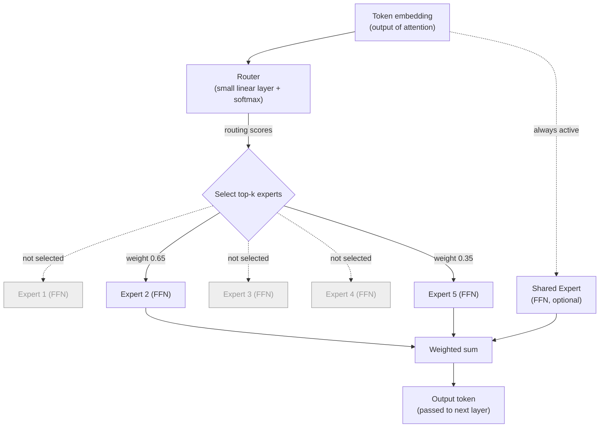

# Mixture of Experts: How Modern LLMs Get Bigger Without Getting Slower

**Pull quotes:**
- "A dense model asks every single neuron to weigh in on every single word. MoE asks: why not just call the specialist?"
- "MoE doesn't make a model smaller. It makes a model that only *uses* a small part of itself at a time."
- "DeepSeek didn't invent Mixture of Experts. It made the experts sharper."
- "MoE doesn't get rid of the trade-off dense models are stuck with. It just moves it from compute, which you pay for every token, to memory, which you pay for once and carry everywhere."

---

Large language models have a simple problem: the more you want them to know, the more parameters you need, and the more parameters you have, the slower and more expensive every single word becomes to generate. Mixture of Experts (MoE) is the architecture that reshaped that trade-off — not erased it, as you'll see, but moved it somewhere more manageable. It's the reason models like DeepSeek-V3, Llama 4, Mixtral, and Qwen3 can carry hundreds of billions of parameters while running each token through only a small fraction of them.

This article covers what MoE is, why it exists, what it costs you in return, what it looks like inside a model, who's using it, and where the research is headed.

---

## 1. What Problem Does This Solve? (Shortcomings of Dense FFNs)

**A story: the village doctor.**

Once there was a small village with one doctor. When the village was small, this worked fine — the doctor learned everything there was to know about the villagers' health, and one person could hold it all in their head. Every patient who walked in, from a child with a cough to an elder with a broken bone, got seen by the same doctor, and the doctor handled it.

The village grew. And grew. Soon the doctor wasn't just treating coughs and broken bones — she had to keep up with cardiology, dermatology, oncology, pediatrics, and a dozen other fields, because the town council's answer to "the village needs to handle more kinds of illness" was always the same: "make the doctor learn more."

So she studied harder. Her knowledge became vast — genuinely, she now knew more medicine than almost anyone alive. But something strange happened at the clinic. Every single patient, no matter how simple their complaint, now had to wait while she mentally sorted through her *entire* accumulated knowledge — heart conditions, skin conditions, childhood illnesses, all of it — just to answer "you have a common cold, here's some rest and fluids." A five-minute checkup that used to take five minutes now took much longer, because there was simply more in her head to sift through before she could respond, for every patient, every time.

Worse, her knowledge was becoming a blur. She was so busy being *everything to everyone* that she was never able to go deep on any one thing the way a dedicated specialist could. A true cardiologist, seeing only heart patients all day, would have sharper, faster, more specialized instincts. But the village had one doctor, one brain, one shared set of knowledge — and every patient, useful or not, paid the cost of all of it.

The town council had, without meaning to, built a system where **growing what the clinic knew and growing how long every visit took were the same lever.** There was no way to add more medical knowledge without every single patient — even the ones with a common cold — waiting longer for it.

This is exactly the situation a dense feed-forward network (FFN) is in.

**Translating the story back to the model.** In a standard ("dense") transformer, every token that flows through a layer is processed by the **same** feed-forward network — the same weights, every time, for every token, regardless of whether the token is "the," "photosynthesis," or a line of Python. Just like the village doctor, that single network has to hold everything it has ever learned — grammar, code syntax, chemistry, poetry — inside one shared set of weights, and every token pays the full cost of activating all of it, whether it needed most of that knowledge or not. This creates three concrete problems:

**1. Compute scales linearly with parameters.** If you want a dense model to know more, you make the FFN bigger. But because *every* token uses the *entire* FFN, doubling the parameters roughly doubles the compute cost of every forward pass — exactly like every patient's visit getting slower as the doctor's total knowledge grew.

**2. One-size-fits-all weights.** A dense FFN can't easily dedicate a chunk of itself to "handles chemistry vocabulary" and a different chunk to "handles Python syntax," because there's no mechanism to selectively activate different parts of the network for different inputs — the doctor can't just switch off her oncology knowledge while looking at a common cold.

**3. Diminishing returns from raw scale.** Beyond a certain point, simply making a dense FFN bigger yields smaller and smaller quality improvements per unit of added compute — you're paying full price for capacity that any individual token barely uses, the same way the village pays for the doctor's cardiology expertise on every single visit, cough or not.

What the village actually needed, and what a dense FFN actually needs, is a way to grow how much the *system* knows without making every single visit slower — a general practitioner who refers patients to the right specialist instead of trying to be all specialists at once. That's exactly what Mixture of Experts provides, and it's the subject of the next section.

---

## 2. What Is Mixture of Experts?

Picture a hospital instead of a lone village doctor. When a patient walks in, you don't send them to every doctor in the building — a general practitioner looks at the case and refers them to the right specialist: a cardiologist, a dermatologist, whoever fits. The hospital as a whole knows a huge amount, but any single patient only interacts with one or two of its doctors.

MoE applies this idea to a neural network. In a normal (dense) transformer, every token passes through one feed-forward network (FFN), and every parameter in that FFN does some work on every token. In an MoE layer, that single FFN is replaced by:

- A set of **experts** — many smaller FFNs (could be 8, could be 256), each structurally identical but with its own separately trained weights.
- A **router** (sometimes called a gate) — a small learned network that looks at each token and decides which expert(s) should handle it.

For each token, the router picks a small number of experts (commonly 1, 2, or 8 out of hundreds), sends the token only to those, and combines their outputs — usually weighted by how confident the router was in each pick.

The result: the model's **total parameter count** can be enormous (all the experts combined), but the **active parameter count** for any given token — and therefore the compute cost — stays small. This is usually described as the difference between a model's total size and its active size, e.g. "671B total, 37B active." Concretely: a dense model with 671B parameters would cost roughly 18x more compute per token to run than the MoE version that only activates 37B — same total knowledge in the building, a fraction of the cost per patient.

> **First-principles summary:** MoE trades a network that always does a medium amount of work for a network that almost always does a small amount of work, but occasionally has access to a huge amount of specialized knowledge.

---

## 3. Why Would You Want This? (Use Cases)

**Scaling knowledge without scaling cost.** The main reason labs adopt MoE is simple: you can grow a model's capacity (how much it can "know" or represent) without a proportional growth in the cost of running it. This is why frontier-scale models today routinely have total parameter counts in the hundreds of billions to low trillions, while only activating tens of billions per token — something that would be computationally unaffordable in a dense model of the same total size.

**Specialization across domains.** Because different experts can end up specializing — some picking up more math-heavy patterns, others more attuned to code, dialogue, or specific languages — MoE models can, in principle, handle a broader range of tasks well without one generalist FFN having to do everything adequately but nothing brilliantly.

**Cheaper training and serving at a given quality bar.** For a fixed compute budget, MoE models tend to reach a given quality level faster than dense models of equivalent active size, because the extra (inactive-per-token) parameters still contribute useful capacity during training even though they're cheap to run at inference.

**Multi-task and multi-modal systems.** Because routing can be learned per token (or even per modality), MoE is a natural fit for models that need to handle text, code, and other modalities without one shared block being a bottleneck.

---

## 4. The Catch: MoE Saves Compute, Not Memory

Everything so far makes MoE sound like a free lunch — more capacity, same compute. It isn't. MoE trades one bottleneck for a different one, and it's worth being honest about what that trade is before going further.

**You still have to store every expert.** A router only *activates* a couple of experts per token, but it doesn't know which ones until it sees the token — so every expert has to sit ready in memory at all times, just in case. A model described as "671B total / 37B active" needs enough GPU memory to hold all 671B parameters, even though any single token only touches 37B of them. MoE saves *compute* (FLOPs per token) but does almost nothing for *memory* — in some ways it makes the memory problem worse, since you're now paying to store a much bigger model than the compute budget alone would justify.

**Serving it is a distributed-systems problem.** Because all the experts must be available, large MoE models are typically split across many GPUs — different experts living on different devices (expert parallelism). Every token then has to be physically routed, over the network, to whichever device holds its chosen expert, and the result routed back. That's real communication overhead that a dense model never has to deal with, and it's a major reason MoE inference systems are more complex to build and tune than dense ones.

**Training has its own failure mode.** The router is learned, not designed, and left alone it tends to collapse onto a favorite handful of experts early in training — the rest starve, undertrain, and never catch up. Avoiding this (via auxiliary losses, bias-based balancing, etc.) is most of what MoE-specific training research is about; see Section 7.

None of this erases MoE's advantage — it's still the reason frontier models can be as capable as they are per dollar of inference compute — but it explains why MoE didn't fully replace dense models everywhere, and why so much of the research effort (next section) is about managing this trade rather than the basic routing idea itself.

---

## 5. Architecture Diagram

Here's what a single MoE layer looks like, replacing the FFN inside a transformer block:

*(Experts 1, 3, and 4 exist in the layer but weren't picked for this token — they simply don't run, so they cost nothing for this forward pass.)*

**Reading the diagram:**
1. A token's vector arrives at the MoE layer.
2. The **router** scores every expert for this token and picks the top-k (e.g. top-2 out of 128).
3. The token is sent *only* to those chosen experts — the rest do zero work for this token.
4. Each chosen expert's output is scaled by the router's confidence score and summed.
5. Some architectures (DeepSeekMoE, Llama 4, Qwen3) also add a **shared expert** that runs on every token unconditionally, capturing common knowledge so the routed experts don't have to re-learn it repeatedly.

---

## 6. Which LLMs Are Using MoE?

MoE went from a research curiosity to the default architecture for frontier-scale open models within a few years. As of mid-2026:

| Model | Total params | Active params | Experts |
|---|---|---|---|
| **DeepSeek-V3 / R1** | ~671B | ~37B | 256 routed + 1 shared |
| **DeepSeek-V4** (Pro / Flash) | 1.6T / 284B | 49B / 13B | fine-grained routed + shared |
| **Mixtral 8x22B** | 141B | 39B | 8 experts, top-2 |
| **Qwen3-235B-A22B** | 235B | ~22B | 128 experts, top-8 |
| **Llama 4 Scout / Maverick** | 109B / ~400B | 17B / 17B | 16 experts + shared expert |
| **Grok-1 / Grok-2** | 314B+ | ~70–80B | MoE (xAI) |
| **Mistral Large / Kimi K2 / GPT-OSS** | varies | varies | MoE |

A few things worth noting:
- The naming convention "A22B," "17B active," etc. refers to **active** parameters per token — the number that actually determines inference cost, not the flashier total parameter count.
- The trend across 2025–2026 has been toward **more, smaller experts** (fine-grained routing — e.g. 128–256 experts) rather than fewer, larger ones (Mixtral's original 8), because fine-grained experts specialize more precisely and reduce redundant knowledge across experts.
- Not every major lab has publicly confirmed using MoE for their flagship models — architecture details for some closed models (e.g. Anthropic's Claude family and Google's Gemini) haven't been disclosed, so they're excluded from confident claims here.
- The DeepSeek-V4 figures above come from third-party reporting rather than a primary technical report at time of writing — treat them as directionally right but verify against DeepSeek's own release notes before citing them as fact.

---

## 7. Current Research Directions

MoE looks simple in a diagram, but making the router behave well in practice is an active, ongoing research problem. A few threads as of 2026:

**Load balancing without hurting quality.** Early MoE models added an extra "auxiliary loss" term during training to stop the router from dumping all tokens onto a handful of favorite experts (a failure mode called "routing collapse"). The problem: that auxiliary loss creates its own gradient pressure that can fight against the model's actual objective. DeepSeek-V3 popularized an **auxiliary-loss-free** approach instead — adjusting each expert's routing bias directly based on how overloaded or underused it's been, without touching the training loss at all.

**Finer-grained expert segmentation.** DeepSeekMoE's core contribution (building on Shazeer et al.'s original sparsely-gated MoE and Google's GShard) was splitting experts into many smaller, more specialized units, plus adding always-on **shared experts** to absorb common knowledge — so routed experts don't waste capacity re-learning things every expert needs anyway. This is now close to standard practice.

**Better specialization signals.** Auxiliary-loss balancing tends to push routing toward being *too* uniform, which can cause experts to overlap in what they learn rather than truly specializing. Newer proposals add extra objectives — like orthogonality losses (push experts to be different from each other) or variance losses (push routing decisions to be more decisive) — to encourage sharper specialization without sacrificing balance.

**Rethinking who chooses.** Most MoE designs let the router pick the experts (token-choice routing). Some recent work — like Autonomy-of-Experts — flips this: experts themselves signal how well they'd handle a given token, and routing follows that signal, aiming to avoid routers making picks disconnected from what experts can actually do well.

**MoE beyond text.** Researchers are extending sparse expert routing into multimodal models — routing not just by token content but by modality or task, so a single model can allocate distinct expert capacity to, say, vision versus language versus audio.

**Attacking the memory problem, not just the compute problem.** Section 4 flagged that MoE shifts the bottleneck from compute to memory — every expert has to sit ready even though only a couple run per token. Active research here includes **expert offloading** (keeping cold, rarely-used experts on CPU RAM or even SSD and streaming them onto the GPU only when routed to), **expert-level quantization** (compressing rarely-hit experts more aggressively than hot ones), and **routing-aware prefetching** (predicting which experts the next few tokens will need and loading them ahead of time). None of these are fully solved — they're the current frontier of making MoE's memory bill match its compute bill.

---

## Closing

The story this article opened with — the village doctor who couldn't grow her knowledge without slowing down every patient — is the exact trade-off dense FFNs are stuck with, and MoE is the architectural fix: split the doctor into a hospital of specialists, and route each patient to only the ones they need. That's what let model *capacity* and per-token *compute* stop moving in lockstep, and it's why nearly every frontier open model released since 2024 has adopted some form of it.

But as Section 4 covered, MoE didn't remove the trade-off — it moved it. Compute got cheaper per token; memory, serving infrastructure, and training stability got harder. Most of what's happening in MoE research right now (Section 7) isn't about the core idea — routing tokens to a subset of experts — it's about managing that new trade as cleanly as possible: balancing load without fighting the training objective, making experts specialize rather than overlap, and figuring out who should really be doing the choosing, the router or the experts themselves.

---

## 8. Further Reading

**Foundational papers:**
- Shazeer et al., 2017 — [Outrageously Large Neural Networks: The Sparsely-Gated Mixture-of-Experts Layer](https://arxiv.org/abs/1701.06538) — the original sparsely-gated MoE.
- Lepikhin et al., 2020 — [GShard: Scaling Giant Models with Conditional Computation and Automatic Sharding](https://arxiv.org/abs/2006.16668) — scaling MoE across many devices.
- Fedus et al., 2021 — [Switch Transformer](https://arxiv.org/abs/2101.03961) — simplified top-1 routing at scale.

**DeepSeek's contributions:**
- Dai et al., 2024 — [DeepSeekMoE: Towards Ultimate Expert Specialization in Mixture-of-Experts Language Models](https://arxiv.org/abs/2401.06066) — fine-grained expert segmentation + shared experts.
- DeepSeek-AI, 2024 — [DeepSeek-V3 Technical Report](https://arxiv.org/abs/2412.19437) — auxiliary-loss-free load balancing at production scale.
- Wang et al., 2024 — [Auxiliary-Loss-Free Load Balancing Strategy for Mixture-of-Experts](https://arxiv.org/abs/2408.15664).

**Newer research directions:**
- [Autonomy-of-Experts Models](https://arxiv.org/abs/2501.13074) — expert-driven routing.
- Jiang et al., 2024 — [Mixtral of Experts](https://arxiv.org/abs/2401.04088) — the Mixtral 8x7B/8x22B architecture.

**In this repo:**
- [`transformer/llama4/MoE.md`](../transformer/llama4/MoE.md) — code-level walkthrough of Llama 4's MoE implementation.
- [`transformer/llama4/DenseVsSparseMoEDispatch.md`](../transformer/llama4/DenseVsSparseMoEDispatch.md) — dispatch mechanics for sparse vs. dense MoE.
