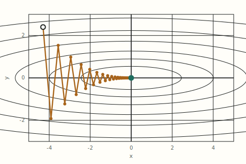
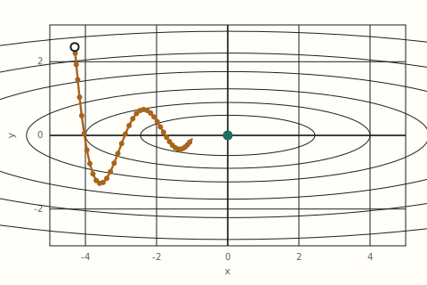
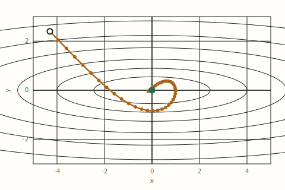
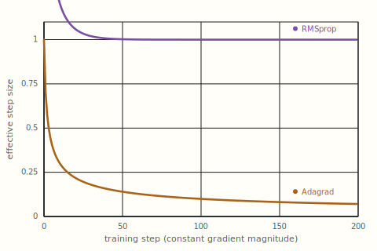
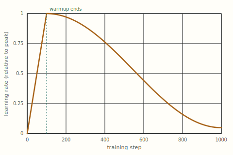

# Optimizers, Demystified: From Gradient Descent to AdamW

**Pull quotes:**
- "The gradient only ever tells you which direction is downhill right now. Everything an optimizer does beyond that — remembering past steps, rescaling per parameter, deciding how far to go — is a guess about what the loss surface looks like a few steps ahead."
- "SGD with momentum doesn't see any more of the loss landscape than plain SGD does. It just refuses to forget what it saw a moment ago."
- "Adam didn't win because it finds better minima. It won because it's forgiving — it trains reasonably well across a wider range of learning rates and architectures than anything that came before it, which is worth more in practice than being provably optimal on paper."

---

An optimizer is the rule that turns a gradient into a weight update — the difference between "the loss goes down in this direction" and an actual number subtracted from every parameter in the network. This article works through what optimizers do, why plain gradient descent is harder to drive than it looks, and how the field moved from vanilla SGD through momentum and per-parameter adaptive methods to AdamW, the default sitting underneath most transformer training runs today.

---

## Table of contents

1. [What are they?](#1-what-are-they)
2. [Where they live in training](#2-where-they-live-in-training)
3. [The optimizers in active use](#3-the-optimizers-in-active-use)
4. [Trajectories and numbers](#4-trajectories-and-numbers)
5. [A runnable PyTorch comparison](#5-a-runnable-pytorch-comparison)
6. [What optimizers don't solve](#6-what-optimizers-dont-solve)
7. [Summary table](#7-summary-table)
8. [Key takeaways](#8-key-takeaways)
9. [Further reading](#9-further-reading)

---

## 1. What are they?

Backpropagation ends with a gradient: for every parameter $\theta$ in the network, a number $\nabla_\theta \mathcal{L}$ telling you which direction increases the loss. That gradient is not itself a weight update — it is a local, instantaneous slope, valid only in an infinitesimal neighborhood of where you currently stand. An optimizer is the rule that turns that slope into an actual step:

$$\theta_{t+1} = \theta_t - (\text{something built from } \nabla_\theta \mathcal{L})$$

The simplest possible choice — subtract the gradient, scaled by a fixed learning rate — is gradient descent itself:

$$\theta_{t+1} = \theta_t - \eta \, \nabla_\theta \mathcal{L}(\theta_t)$$

Everything covered in this article is a variation on that one line. What varies is what gets built from the gradient before it's subtracted: whether the optimizer remembers previous gradients (momentum), whether it scales the step differently for each parameter based on that parameter's own gradient history (Adagrad, RMSprop, Adam), and whether weight decay is folded into the gradient or applied separately (AdamW).

**Why the naive version isn't enough.** A single global learning rate assumes every parameter's loss surface has roughly the same curvature — the same steepness in every direction. It almost never does. A weight that gets a small, noisy gradient every step and a weight that gets a large, consistent one need different step sizes to make comparable progress, and a single scalar $\eta$ cannot give them different treatment. That mismatch, worked out concretely, is the entire motivation for every optimizer beyond plain SGD.

---

## 2. Where they live in training

The optimizer sits at the very end of one training step, after the forward pass and backpropagation have already produced a gradient for every parameter:

```
batch → forward pass → loss → backward pass → ∇θ for every parameter → optimizer.step() → θ updated
```

It touches every parameter in the model — every attention weight, every FFN matrix, every embedding row — but it does not see the model architecture, the data, or the loss function directly. Its entire universe is the current parameter values, the current gradient, and whatever running statistics it has chosen to keep from previous steps. This is a useful boundary to keep in mind: the optimizer cannot fix a bad loss landscape, a saturating activation function, or a badly scaled input — those are upstream of it. What it can do is decide, given a gradient, how to convert that gradient into a step that makes reliable progress despite noise, curvature, and scale differences across parameters.

Two properties of that decision matter enough to track for every optimizer below:

**Memory.** Does the update depend only on the current gradient (SGD), or does it accumulate information across steps (momentum's running average of gradients, Adam's running average of squared gradients)? Memory is what lets an optimizer distinguish a consistent downhill direction from noise, and what lets it notice that a particular parameter has historically had large or small gradients.

**Per-parameter adaptivity.** Does every parameter get the same effective learning rate (SGD, momentum), or does each parameter get its own, scaled by its own gradient history (Adagrad, RMSprop, Adam)? Adaptivity is what makes optimizers robust to the wildly different gradient scales that show up across a real network's layers, at the cost of extra memory — an adaptive optimizer typically stores one or two extra numbers per parameter, doubling or tripling the optimizer state's memory footprint relative to the model itself.

---

## 3. The optimizers in active use

Five update rules, two eras: fixed-step and momentum-based descent that treats every parameter identically, and the adaptive family that gives each parameter its own effective learning rate.

### SGD *(stochastic gradient descent, 1950s–present)*

**Intuition first.** Stand on a hillside in fog, feel which way is steepest downhill using only where you're standing right now, and take one step of a fixed size in that direction. Repeat, using a fresh, noisy view of the slope every time — "stochastic" because in deep learning the gradient is estimated from a random mini-batch, not the full dataset, so every step's direction is a noisy sample rather than the true slope.

$$\theta_{t+1} = \theta_t - \eta \, g_t \qquad g_t = \nabla_\theta \mathcal{L}(\theta_t)$$

The entire update is one number, $\eta$, multiplying one gradient. There is no memory — step $t{+}1$ has no idea what step $t$'s gradient looked like — and no adaptivity — every parameter, however differently scaled its gradients are, gets multiplied by the same $\eta$. That simplicity is also SGD's weakness on real loss surfaces: a surface that's steep in one direction and shallow in another (a "ravine") forces a choice between an $\eta$ small enough not to overshoot in the steep direction, which then crawls uselessly slowly in the shallow one, or an $\eta$ large enough to make progress in the shallow direction, which then oscillates or diverges in the steep one. [Section 4](#4-trajectories-and-numbers) shows exactly this zigzag in a concrete example.

**Worked example.** Take a single parameter at $\theta_t = 3.0$ with gradient $g_t = 0.8$ and $\eta = 0.1$:

$$\theta_{t+1} = 3.0 - 0.1 \times 0.8 = 2.92$$

No history is consulted, none is stored. The exact same computation, with the exact same result, would run whether this were step 1 or step 10,000.

### SGD with Momentum *(1964, adopted for deep learning ~2010s)*

**Intuition first.** A ball rolling downhill doesn't reset its velocity to zero every instant — it carries momentum from where it's been, so a consistent slope keeps accelerating it while a momentary bump or noisy patch barely deflects it. Momentum gives the optimizer the same property: instead of stepping along the current gradient alone, it steps along a running, exponentially-weighted average of *all* recent gradients.

$$v_t = \beta v_{t-1} + (1-\beta)\, g_t \qquad \theta_{t+1} = \theta_t - \eta\, v_t$$

$\beta$ (typically 0.9) controls how much history persists — at $\beta=0.9$, roughly the last 10 steps' gradients dominate the running average, with older ones decaying away geometrically. The mechanism that actually helps on a ravine-shaped loss surface: in the steep direction, consecutive gradients keep flipping sign (overshoot, correct, overshoot the other way), so their running average partially cancels and the effective step shrinks — exactly the damping SGD lacks. In the shallow direction, consecutive gradients point the same way, so the running average keeps growing and the effective step accelerates. One mechanism produces both the damping and the acceleration; it isn't two separate fixes.

**Worked example.** Take three consecutive gradients on the same parameter — $g_1 = 1.0$, $g_2 = -0.6$ (a sign flip, as happens crossing a ravine), $g_3 = 0.9$ — with $\beta = 0.9$, $v_0 = 0$:

$$v_1 = 0.9(0) + 0.1(1.0) = 0.100$$
$$v_2 = 0.9(0.100) + 0.1(-0.6) = 0.030$$
$$v_3 = 0.9(0.030) + 0.1(0.9) = 0.117$$

Notice $v_2$ barely moved despite $g_2$ being a fairly large negative gradient — the accumulated positive history from $g_1$ absorbed most of it. Compare to plain SGD, which would have used $g_2 = -0.6$ directly and stepped in the *opposite* direction that step. Momentum's step 2 still moved (mildly) in the positive direction, because it's reacting to a trend, not a single noisy sample.

**Nesterov momentum**, a common variant, evaluates the gradient not at $\theta_t$ but at the point momentum was already about to carry you to ($\theta_t - \eta\beta v_{t-1}$) — a small lookahead correction that lets the optimizer react to the slope it's about to encounter rather than the one it just left. It changes where the gradient is measured, not the core idea of accumulating a running average.

### Adagrad *(Adaptive Gradient, 2011)*

**Intuition first.** Instead of one learning rate for every parameter, give each parameter its own, and shrink it in proportion to how much that specific parameter has moved historically — a parameter with a long history of large gradients has already "used up" some of its budget and gets throttled; one that's barely been touched keeps its full step size.

$$s_t = s_{t-1} + g_t^2 \qquad \theta_{t+1} = \theta_t - \frac{\eta}{\sqrt{s_t} + \epsilon}\, g_t$$

$s_t$ is a running *sum* — not average — of every squared gradient this parameter has ever received, so it only grows, never shrinks. Dividing by $\sqrt{s_t}$ means the effective learning rate for each parameter is unique and history-dependent: two parameters starting with the same $\eta$ can end up with wildly different effective step sizes after a few hundred steps, purely because one has seen larger gradients than the other. This solved a real problem — sparse features (a word embedding that only updates on the rare batches containing that word) need larger steps when they finally do get a gradient, and Adagrad gives them exactly that. The flaw is in the same mechanism that provides the benefit: because $s_t$ only accumulates and never decays, the effective learning rate monotonically shrinks toward zero over training, and on a long run it eventually shrinks enough to stall learning entirely — worked out in [Section 4](#4-trajectories-and-numbers).

**Worked example.** Take a parameter receiving three consecutive gradients of $g = 0.5$ each (deliberately constant, to isolate the accumulation effect), with $\eta = 1.0$, $\epsilon = 10^{-8}$:

$$s_1 = 0.25,\quad s_2 = 0.50,\quad s_3 = 0.75$$

$$\text{effective step}_1 = \frac{1.0}{\sqrt{0.25}} = 2.00 \qquad \text{effective step}_3 = \frac{1.0}{\sqrt{0.75}} = 1.15$$

Same gradient magnitude every step, but the effective multiplier on that gradient dropped by nearly half in just three steps — and it keeps dropping for as long as training continues, with no mechanism to recover.

### RMSprop *(Root Mean Square Propagation, 2012)*

**Intuition first.** Take Adagrad's idea — scale each parameter's step by its own gradient history — but fix the one-way accumulation by replacing the running *sum* with a running, exponentially-decayed *average*, the same trick momentum uses for the gradient itself, applied here to the squared gradient instead.

$$s_t = \gamma s_{t-1} + (1-\gamma)\, g_t^2 \qquad \theta_{t+1} = \theta_t - \frac{\eta}{\sqrt{s_t} + \epsilon}\, g_t$$

Because $s_t$ is now a decaying average (typically $\gamma = 0.9$ or $0.99$) rather than an ever-growing sum, it settles into an equilibrium that tracks *recent* gradient magnitude rather than *all-time* gradient magnitude. A parameter that had large gradients early in training but small ones now will have its effective learning rate recover, rather than staying throttled forever by ancient history — precisely the failure mode that kills Adagrad on long training runs. [Section 4](#4-trajectories-and-numbers) plots both side by side on the same constant-gradient input, and the divergence between "shrinks to zero" and "settles at a floor" is the whole story.

**Worked example.** Same setup as the Adagrad example — three consecutive gradients of $g=0.5$ — but with RMSprop's $\gamma = 0.9$, $\eta=1.0$, $s_0 = 0$:

$$s_1 = 0.9(0) + 0.1(0.25) = 0.025$$
$$s_2 = 0.9(0.025) + 0.1(0.25) = 0.0475$$
$$s_3 = 0.9(0.0475) + 0.1(0.25) = 0.0678$$

$$\text{effective step}_1 = \frac{1.0}{\sqrt{0.025}} = 6.32 \qquad \text{effective step}_3 = \frac{1.0}{\sqrt{0.0678}} = 3.84$$

The effective step is still dropping over these three steps (both methods start from zero history and take a few steps to reach equilibrium), but unlike Adagrad, it converges to a *stable floor* around $1/\sqrt{0.25}=2.0$ once $s_t$ equilibrates — it does not continue toward zero as training goes on.

### Adam and AdamW *(Adaptive Moment Estimation, 2014 / 2017–present)*

**Intuition first.** Adam is momentum and RMSprop combined: keep a running average of the gradient itself (momentum's $m_t$, called the "first moment") *and* a running average of the squared gradient (RMSprop's $s_t$, called the "second moment"), then use the first to decide direction and the second to decide per-parameter step size.

$$m_t = \beta_1 m_{t-1} + (1-\beta_1) g_t \qquad v_t = \beta_2 v_{t-1} + (1-\beta_2) g_t^2$$

$$\hat{m}_t = \frac{m_t}{1-\beta_1^t} \qquad \hat{v}_t = \frac{v_t}{1-\beta_2^t}$$

$$\theta_{t+1} = \theta_t - \eta \, \frac{\hat{m}_t}{\sqrt{\hat{v}_t}+\epsilon}$$

Two design details do real work here beyond "combine the two ideas." First, **bias correction** ($\hat m_t$, $\hat v_t$): both $m_t$ and $v_t$ start at zero, so in the first few steps they're biased toward zero too — dividing by $1-\beta_1^t$ (which is small when $t$ is small and approaches 1 as $t$ grows) corrects for that early-training underestimate. Second, the defaults ($\beta_1=0.9$, $\beta_2=0.999$, $\epsilon=10^{-8}$) were tuned to be forgiving across a very wide range of architectures and problems — a large part of why Adam displaced SGD as the default optimizer for transformers is that it trains *acceptably* with far less per-problem learning-rate tuning than SGD needs, not that it necessarily finds a better final loss.

**Where AdamW changes things.** Weight decay — pulling every weight slightly toward zero each step, as a regularizer — was traditionally implemented by adding $\lambda\theta$ to the gradient before it ever reaches the optimizer (L2 regularization). Inside plain Adam, that decay term gets divided by $\sqrt{\hat v_t}$ along with the real gradient — which means the amount of decay a parameter actually receives depends on that parameter's gradient history, an entangled and largely accidental effect nobody had intended. AdamW's fix, decoupled weight decay, applies the decay directly to $\theta$ *outside* the adaptive-scaling step:

$$\theta_{t+1} = \theta_t - \eta\left(\frac{\hat{m}_t}{\sqrt{\hat{v}_t}+\epsilon} + \lambda \theta_t\right)$$

Every parameter now decays by the same proportion of its own value, regardless of its gradient history — decay and adaptive scaling no longer interfere. This is a small change in the formula and a real change in behavior, and it's why AdamW, not the original Adam, is the default inside essentially every modern transformer training recipe.

**Worked example.** Single parameter, $\theta_t = 2.0$, $g_t = 0.4$, at step $t=2$ (so bias correction still matters), with $m_1 = 0.5\times0.4=... $ — to keep it self-contained, start fresh with $m_0=v_0=0$, $\beta_1=0.9$, $\beta_2=0.999$, and two identical gradients $g_1=g_2=0.4$:

$$m_1 = 0.1(0.4) = 0.04 \qquad v_1 = 0.001(0.16) = 0.00016$$
$$m_2 = 0.9(0.04)+0.1(0.4) = 0.076 \qquad v_2 = 0.999(0.00016)+0.001(0.16) = 0.00032$$

$$\hat{m}_2 = \frac{0.076}{1-0.9^2} = \frac{0.076}{0.19} = 0.400 \qquad \hat{v}_2 = \frac{0.00032}{1-0.999^2} = \frac{0.00032}{0.002} = 0.160$$

$$\theta_3 = 2.0 - 0.1 \times \frac{0.400}{\sqrt{0.160}+10^{-8}} = 2.0 - 0.1 \times 1.0000 = 1.900$$

With AdamW and $\lambda = 0.01$, an extra $-\eta\lambda\theta_t = -0.1 \times 0.01 \times 2.0 = -0.002$ gets subtracted directly, giving $\theta_3 = 1.898$ — a small, gradient-independent nudge toward zero layered cleanly on top of the adaptive update.

### A newer entrant: Muon

Every optimizer above treats a weight matrix as a flat bag of independent scalars — each entry gets its own $m$ and $v$, updated with no awareness that the other entries in the same matrix even exist. **Muon**, used for the transformer weight matrices in some recent training recipes (with AdamW kept for embeddings and scalar parameters), instead orthogonalizes the gradient *matrix* as a whole via a Newton-Schulz iteration before applying it — an attempt to remove redundancy between highly correlated gradient directions within a matrix, something no per-scalar method can see. It's a fundamentally different axis of improvement — from *per-parameter* adaptivity to *per-matrix* structure — and is covered in depth in [`training-stability/muon-optimizer.md`](training-stability/muon-optimizer.md).

### Use cases at a glance

*Condensed from the "Intuition first" lines above.*

| Optimizer | Primary use case | Example models / settings |
|---|---|---|
| SGD (+ momentum) | Vision models, well-behaved loss surfaces, settings where tuning budget is available | ResNet, VGG, classic CNN training recipes |
| Adagrad | Sparse features / sparse gradients (rare tokens, rare categories) | Early large-scale linear models, sparse embeddings |
| RMSprop | Non-stationary objectives, RNN training | Early deep RNN / LSTM training recipes |
| Adam / AdamW | Default for transformer pretraining and fine-tuning | GPT, BERT, Llama, essentially all modern LLM training |
| Muon | Transformer weight matrices specifically, alongside AdamW for the rest | Recent open-weight LLM training recipes |

### Pros and cons at a glance

*Condensed from the bullet lists above, for quick side-by-side scanning.*

| Optimizer | Pros | Cons |
|---|---|---|
| SGD | Simple, cheap, no extra memory; well-understood convergence theory | No memory or adaptivity — struggles on ravines; needs careful, problem-specific learning-rate tuning |
| SGD + Momentum | Damps oscillation, accelerates in consistent directions; still cheap (one extra buffer) | Adds a tuned hyperparameter ($\beta$); still one global learning rate across all parameters |
| Adagrad | Per-parameter adaptivity; excels on sparse gradients | Effective learning rate monotonically decays to zero — stalls on long training runs |
| RMSprop | Fixes Adagrad's decay-to-zero problem; adapts to recent gradient scale | No momentum term by default; needs its own tuned decay rate |
| Adam / AdamW | Combines momentum and adaptivity; forgiving defaults across architectures; AdamW cleanly separates decay from adaptive scaling | Stores two extra buffers per parameter (memory cost); can generalize slightly worse than well-tuned SGD in some vision settings |
| Muon | Removes redundancy within a weight matrix that per-scalar methods can't see | Newer, less battle-tested; needs AdamW alongside it for non-matrix parameters; extra Newton-Schulz compute per step |

---

## 4. Trajectories and numbers

The clearest way to see what memory and adaptivity actually buy you is to watch three optimizers descend the same lopsided loss surface, and to watch Adagrad and RMSprop's effective step sizes diverge on the same constant input.

### Example 1 — The Same Ravine, Three Ways

**Setup:** a toy loss $f(x,y) = 0.05x^2 + y^2$ — a bowl that's twenty times steeper in $y$ than in $x$, the same "ravine" shape that motivated momentum in the first place. All three optimizers start at the same point, $(-4.3,\ 2.4)$, and run 40 steps toward the minimum at the origin (marked in teal).



Plain SGD (learning rate chosen near the largest stable value for the steep direction) zigzags hard across $y$ — the sign of the gradient in $y$ flips almost every step — while barely making progress along the shallow $x$ axis, where the same learning rate is far too conservative. This is the single-learning-rate mismatch from [Section 1](#1-what-are-they) made visible: no value of $\eta$ is simultaneously right for both axes.



Momentum, on the same surface, oscillates far less — the running average of gradients partially cancels the sign-flipping in $y$, exactly as the worked example in [Section 3](#3-the-optimizers-in-active-use) showed with three numbers.



Adam takes the most direct path of the three. Dividing by $\sqrt{\hat v_t}$ separately for $x$ and $y$ means each axis effectively gets its *own* learning rate, roughly compensating for the 20x curvature difference between them — the exact mismatch that made a single global $\eta$ impossible to choose well for SGD.

### Example 2 — Adagrad's Decay vs. RMSprop's Floor

**Setup:** feed both optimizers the exact same input forever — a constant gradient magnitude of 1.0 every single step — and track the effective step size ($\eta / (\sqrt{s_t}+\epsilon)$, with $\eta=1$) each produces.



Adagrad's curve keeps falling for the entire 200-step window and never levels off — because $s_t$ is a running *sum*, it grows without bound even under a constant input, so the effective step keeps shrinking for as long as training continues. RMSprop's curve drops over the first ~20 steps as its exponential average reaches equilibrium, then goes flat: because $s_t$ is a running *average* with a fixed decay rate, it converges to a stable value determined by the current gradient scale, not the total step count. This single plot is the entire reason RMSprop (and by extension Adam) replaced Adagrad as the adaptive method of choice for anything but genuinely sparse, one-shot gradients.

---

## 5. A runnable PyTorch comparison

The snippet below runs SGD, SGD+Momentum, Adagrad, RMSprop, and AdamW on the same toy quadratic from Section 4, so their step counts to convergence can be compared directly.

```python
import torch

def loss_fn(p):
    x, y = p[0], p[1]
    return 0.05 * x**2 + y**2

optimizers = {
    "sgd":          lambda p: torch.optim.SGD([p], lr=0.9),
    "sgd_momentum": lambda p: torch.optim.SGD([p], lr=0.35, momentum=0.9),
    "adagrad":      lambda p: torch.optim.Adagrad([p], lr=0.5),
    "rmsprop":      lambda p: torch.optim.RMSprop([p], lr=0.1),
    "adamw":        lambda p: torch.optim.AdamW([p], lr=0.35, weight_decay=0.0),
}

for name, make_opt in optimizers.items():
    p = torch.tensor([-4.3, 2.4], requires_grad=True)
    opt = make_opt(p)
    for step in range(40):
        opt.zero_grad()
        loss = loss_fn(p)
        loss.backward()
        opt.step()
    print(f"{name:>13}: final=({p[0].item():.4f}, {p[1].item():.4f})  loss={loss_fn(p).item():.6f}")
```

Running this reproduces the shapes in Section 4 numerically: SGD and Adagrad are still visibly far from `(0, 0)` after 40 steps, SGD+Momentum has made clear progress on both axes, and AdamW is closest to the minimum — the practical payoff of adapting the step size per parameter instead of using one global learning rate.

---

## 6. What optimizers don't solve

No optimizer is a complete fix, and picking a better one does not make other training problems disappear.

**They don't fix a bad loss landscape.** An optimizer can only act on the gradient it's given. If the underlying architecture produces vanishing or exploding gradients — the problem [activation functions](activation-functions.md) and normalization layers exist to address — no amount of momentum or adaptivity recovers a signal that was never there.

**Adaptive methods can generalize slightly worse than well-tuned SGD.** In several vision benchmarks, models trained with plain SGD and a carefully hand-tuned learning-rate schedule have reached better test accuracy than the same architecture trained with Adam — a result that has held up enough to keep SGD+momentum as a live default in some vision pipelines, even as Adam/AdamW dominates transformer training. Adaptivity trades some of that generalization margin for robustness to hyperparameter choice; which one wins depends on how much tuning budget is actually available.

**Learning rate scheduling is a separate axis from the optimizer itself.** Every optimizer above still takes a global $\eta$ as an argument, and in practice $\eta$ is rarely held constant — a warmup-then-decay schedule (linear warmup into a cosine decay is common for transformer pretraining) is layered on top of whichever optimizer is chosen.



Warmup exists because early in training, before the running statistics inside momentum or Adam's $m_t$/$v_t$ have had time to equilibrate, a full-sized learning rate can produce a step large enough to destabilize training outright — this is a colder-start problem for adaptive optimizers specifically, since their step-size estimate is least reliable in exactly this window. None of this is the optimizer's update rule; it's a modulation applied to $\eta$ regardless of which rule is underneath.

**Optimizer state has a real memory cost.** Adam and AdamW store two extra buffers ($m_t$, $v_t$) per parameter — for a model with $N$ parameters, that's $2N$ extra numbers, commonly doubling or tripling total training memory relative to the model weights alone. This is one motivation behind memory-efficient variants (8-bit Adam, factored second-moment estimates) and behind approaches like Muon that try to get more out of a matrix-structured update instead of adding more per-scalar state.

**No optimizer removes the need for a working evaluation loop.** A lower training loss is not the goal; a model that performs well on held-out data is. Optimizer choice affects *how* the loss goes down, not whether the number you're driving down is the right number to be watching.

---

## 7. Summary table

*Formulas below are compressed to fit a table row — see [Section 3](#3-the-optimizers-in-active-use) for each one written out in full, with a worked example.*

| Optimizer | Core update | Memory / step | Adaptive? | Key tradeoff |
|---|---|---|---|---|
| SGD | $\theta - \eta g$ | none | No | Simple and cheap, but one learning rate for every parameter |
| SGD + Momentum | $\theta - \eta v,\ v=\beta v+(1-\beta)g$ | 1 buffer | No | Damps oscillation, accelerates consistent directions; still one global $\eta$ |
| Adagrad | $\theta - \frac{\eta}{\sqrt{s}+\epsilon} g,\ s\mathrel{+}=g^2$ | 1 buffer | Yes | Great for sparse gradients; decays to zero on long runs |
| RMSprop | $\theta - \frac{\eta}{\sqrt{s}+\epsilon} g,\ s=\gamma s+(1-\gamma)g^2$ | 1 buffer | Yes | Fixes Adagrad's decay; no built-in momentum |
| Adam / AdamW | $\theta - \eta\left(\frac{\hat m}{\sqrt{\hat v}+\epsilon} + \lambda\theta\right)$ | 2 buffers | Yes | Forgiving defaults, default for LLM training; doubles/triples optimizer memory |
| Muon | Orthogonalized gradient update (matrix-level) | Newton-Schulz iteration, no persistent buffer | Structural, not per-scalar | Exploits matrix structure per-scalar methods can't see; newer, needs AdamW alongside it |

---

## 8. Key takeaways

- **A gradient is not a step.** Every optimizer's job is converting a local slope into a weight update; the differences between optimizers are entirely in what gets built from the gradient before it's subtracted.
- **Memory and adaptivity are the two axes that matter.** Momentum adds memory (a running average of the gradient); Adagrad and RMSprop add per-parameter adaptivity (a running statistic of the *squared* gradient); Adam combines both.
- **The field moved from one-size-fits-all to per-parameter, then from per-parameter to per-matrix.** SGD gives every parameter the same treatment; Adagrad/RMSprop/Adam give each parameter its own effective learning rate; Muon takes a further step by treating a weight matrix as a structured object rather than a bag of independent scalars.
- **Adagrad's flaw and RMSprop's fix are the same mechanism in miniature.** A running *sum* of squared gradients only grows, so the effective learning rate only shrinks; swapping it for a running *average* gives the same adaptivity without the one-way decay.
- **AdamW is a small formula change with outsized practical impact.** Decoupling weight decay from the adaptive gradient scaling removed an accidental interaction nobody had intended, and is the specific reason AdamW rather than plain Adam is the default in modern LLM training recipes.
- **A better optimizer is not a substitute for a better learning-rate schedule, a better architecture, or a working eval loop** — it only controls how efficiently the loss goes down, not whether the loss landscape or the training signal feeding it are sound to begin with.

---

## 9. Further reading

- **"A Method for Stochastic Optimization"** (Kingma & Ba, 2014) — the paper that introduced Adam, combining momentum and per-parameter adaptive scaling with bias correction: arxiv.org/abs/1412.6980

- **"Decoupled Weight Decay Regularization"** (Loshchilov & Hutter, 2017) — the paper that introduced AdamW and diagnosed the interaction between L2 regularization and Adam's adaptive scaling that motivated it: arxiv.org/abs/1711.05101

- **"Adaptive Subgradient Methods for Online Learning and Stochastic Optimization"** (Duchi, Hazan & Singer, 2011) — the paper that introduced Adagrad and its per-parameter adaptive learning rate: jmlr.org/papers/v12/duchi11a.html

- **"On the Importance of Initialization and Momentum in Deep Learning"** (Sutskever, Martens, Dahl & Hinton, 2013) — the paper that established momentum (including Nesterov's variant) as a practical necessity for training deep networks: proceedings.mlr.press/v28/sutskever13.html

- **[`training-stability/muon-optimizer.md`](training-stability/muon-optimizer.md)** — this repository's own deep dive into Muon's Newton-Schulz orthogonalization and why it's paired with AdamW rather than replacing it outright.

---

Every optimizer covered here is a response to a specific, diagnosable limitation of the one before it: SGD's single learning rate gave way to momentum's damped, accelerated steps; a single global step size gave way to Adagrad's per-parameter adaptivity; Adagrad's one-way decay gave way to RMSprop's stable floor; momentum and adaptivity, previously separate ideas, were combined into Adam; and Adam's accidentally-entangled weight decay was cleanly separated out in AdamW. None of it changes what a gradient means — only how much of the network's recent history gets folded into the number that finally gets subtracted from each weight.
