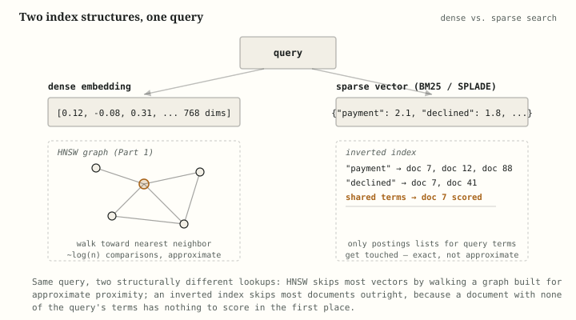
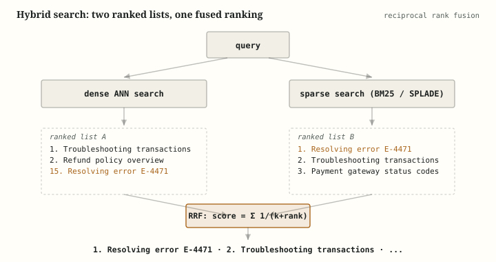

# Vector Databases, Part 2: Sparse Retrieval, Quantization, and Hybrid Search

**Pull quotes:**
- "Dense vectors buy you meaning. Sparse vectors buy you exactness. A production retrieval system doesn't pick one — it runs both and merges the results."
- "Quantization is the same trade the whole field keeps making, applied to memory instead of latency: give up some precision per vector, in exchange for fitting orders of magnitude more vectors in the same RAM."
- "Binary quantization turning a 768-dimensional float32 vector into 768 bits sounds like it should destroy the signal. It mostly doesn't, for the same reason a blurry thumbnail still lets you recognize a face — most of the information was redundant to begin with."

---

Part 1 covered the anatomy of a vector database: embeddings, ANN indexes, distance metrics, filtering. It treated two things as footnotes that this article treats as the main event — how vector databases shrink vectors to fit in memory at scale, and how they combine dense semantic search with lexical, token-based search rather than picking one. This article works through:

- dense vectors versus sparse vectors, and why a database needs to support both
- BM25, the lexical scoring method dense embeddings never fully replaced
- SPLADE, a learned sparse model that sits between BM25 and dense embeddings
- why quantization exists, and the memory problem it's solving
- scalar, product, binary, and rotation-based (TurboQuant) quantization, compared
- reciprocal rank fusion, the mechanism that merges dense and sparse results into one ranking
- a worked example where hybrid search finds something dense-only search misses

---

## Table of contents

1. [Dense vs. sparse vectors](#1-dense-vs-sparse-vectors)
2. [BM25: lexical scoring that never went away](#2-bm25-lexical-scoring-that-never-went-away)
3. [SPLADE: learned sparse retrieval](#3-splade-learned-sparse-retrieval)
4. [Quantization: why compress a vector at all](#4-quantization-why-compress-a-vector-at-all)
5. [Quantization techniques, compared](#5-quantization-techniques-compared)
6. [Hybrid search and reciprocal rank fusion](#6-hybrid-search-and-reciprocal-rank-fusion)
7. [A worked example: where hybrid search wins](#7-a-worked-example-where-hybrid-search-wins)
8. [Summary table](#8-summary-table)
9. [Key takeaways](#9-key-takeaways)
10. [Further reading](#10-further-reading)

---

## 1. Dense vs. sparse vectors



*Same query, two structurally different index lookups — a graph walk on one side, a postings-list lookup on the other. Neither is a special case of the other.*

- **Dense vectors, recapped from Part 1.** An embedding model maps text into a fixed-length vector — typically 300 to a few thousand dimensions — where almost every dimension carries some value, and distance between vectors approximates semantic similarity. Search over dense vectors uses an ANN index (HNSW, IVF) because comparing a query against every stored vector doesn't scale.

- **Sparse vectors work on a different principle entirely.** Instead of a fixed number of dense dimensions, a sparse vector has one dimension per term in a (often huge — tens or hundreds of thousands of terms) vocabulary, and almost all of those dimensions are zero for any given piece of text.
  - A document about "payment declined" might have non-zero weights only on the dimensions for "payment," "declined," "transaction," and a handful of related terms — everything else in the vocabulary is exactly zero, not just small.
  - Each non-zero dimension carries a weight representing how relevant that term is to this piece of text — how that weight gets computed is exactly what distinguishes BM25 from SPLADE, covered in the next two sections.

- **Sparse vectors are searched with an inverted index, not an ANN graph.** Because almost every dimension is zero, there's no need for HNSW's graph-walking trick — instead, the database maintains, for every vocabulary term, a list of which documents have a non-zero weight on that dimension. A query only needs to score documents that share at least one non-zero dimension with it, via a dot product over just those shared dimensions.
  - This is the same underlying data structure a classic full-text search engine like Elasticsearch or Lucene already uses — sparse-vector search is best understood as inverted-index search wearing vector-database vocabulary, not a new mechanism.
  - It's also why sparse search doesn't have an approximation knob the way HNSW has `ef_search`: the inverted-index lookup is already exact and already fast, because zero-weight dimensions are never touched at all rather than approximately skipped.

- **Why bother with both.** Dense vectors capture meaning across a vocabulary gap ("dog" and "canine" land near each other). Sparse vectors capture exact terms with no vocabulary gap at all — an exact SKU, an error code, a rare technical term — because they don't try to generalize away from the literal tokens present. Neither representation subsumes the other; §6 covers how a database combines results from both.

> **Note.** "Sparse" and "dense" describe the *shape* of the vector — mostly-zero versus mostly-nonzero — not which model produced it. A sparse vector isn't automatically simpler or less "learned": SPLADE (§3) produces sparse vectors using a full neural network, while a dense embedding model can, in principle, produce a vector that happens to be sparse. In practice, though, the two shapes are strongly associated with two different families of technique, which is why this article treats them as a natural pairing.

---

## 2. BM25: lexical scoring that never went away

- **BM25 (Best Matching 25) is a scoring function, not a model.** Given a query and a document, it computes a relevance score from three ingredients, with no training and no neural network involved:
  - **Term frequency (TF)** — how often a query term appears in the document, with diminishing returns (a term appearing 10 times isn't 10x as relevant as it appearing once).
  - **Inverse document frequency (IDF)** — how rare the term is across the whole collection; a term that appears in nearly every document (like "the") contributes almost nothing to the score, while a rare term is weighted heavily.
  - **Length normalization** — a term match in a short document counts for more than the same match in a long one, since matches in long documents are partly a function of the document just containing more words.

- **This is exactly the "weight" that turns a document into a sparse vector.** Each vocabulary term is a dimension; BM25 provides the formula for the non-zero weight on the terms actually present in a document. Framed this way, BM25 isn't a separate system bolted onto vector search — it's one specific, unlearned way of producing the sparse vectors described in §1.

- **Why it's still standard infrastructure decades after Word2vec.** BM25 has none of the failure modes a dense embedding has:
  - It's exact — a query for "invoice #4471" cannot accidentally match "invoice #4472," because BM25 has no notion of "close enough," only "present or absent."
  - It's interpretable — a relevance score can be explained per term, which matters for debugging why a result ranked where it did, in a way a 768-number dense vector cannot be explained.
  - It requires no training data and no embedding model to keep in sync with the corpus — re-indexing a changed document is just re-tokenizing it, with none of the staleness risk Part 1 flagged for dense embeddings.
  - It's cheap: no GPU inference at index time or query time, just tokenization and arithmetic.

- **What it structurally cannot do.** BM25 only ever matches literal tokens (or near-literal, depending on stemming/tokenization choices) — it has no mechanism for "canine vaccination schedules" to match "when should I take my dog to the vet," because "canine" and "dog" are different tokens with no shared vocabulary dimension. This is precisely the vocabulary-gap problem Part 1 opened with, and it's the reason BM25 alone is not a substitute for dense or learned-sparse retrieval, only a complement to it.

> **Worth remembering.** BM25 isn't a legacy technique being phased out by embeddings — it's the other half of a two-part system. Most production hybrid search stacks run BM25 (or a learned-sparse variant) and dense vector search in parallel over the same query, precisely because each covers the other's structural blind spot.

---

## 3. SPLADE: learned sparse retrieval

- **SPLADE (SParse Lexical AnD Expansion) sits between BM25 and dense embeddings.** Like BM25, it produces a sparse, vocabulary-dimensioned vector that can be indexed and searched with the same inverted-index machinery. Unlike BM25, the weights come from a trained neural network rather than a term-frequency formula — and, crucially, the network isn't restricted to only weighting terms that are literally present in the text.

- **Term expansion is the key idea.** Given a document about "the car wouldn't start," a SPLADE model can assign a non-zero weight to "automobile" or "ignition" even if neither word appears in the text, because the model has learned that those terms are relevant to the same underlying content. This directly attacks BM25's vocabulary-gap weakness while keeping the sparse representation's exactness and inverted-index speed for whatever terms *are* literally present.

- **How the weights get learned.** SPLADE is trained (typically on query-document relevance pairs, similar to how dense embedding models are trained) to produce sparse activations over a language model's vocabulary — using a sparsity-inducing regularization term during training so that most dimensions land at exactly zero rather than merely small, which is what keeps the resulting vectors compatible with fast inverted-index search rather than degrading into a dense vector in disguise.

- **Where it sits relative to the other two options:**
  - **Versus BM25** — SPLADE replaces a hand-designed statistical formula with learned weights and adds term expansion, at the cost of needing a trained model and GPU inference at index/query time, where BM25 needs neither.
  - **Versus dense embeddings** — SPLADE keeps the interpretability advantage (a SPLADE vector's non-zero dimensions correspond to actual vocabulary terms, so a match can still be explained per term) and the exact inverted-index search structure, while giving up some of the fluid, whole-sentence semantic reach a dense embedding gets from compressing meaning into a small number of dense dimensions.

- **Why it's worth knowing about even if you don't deploy it.** SPLADE is the clearest illustration that "sparse" and "semantic" aren't opposites — the field converged on it specifically because pure lexical matching (BM25) and pure dense embedding search each left something on the table, and SPLADE was one of the more influential attempts to take the better parts of both without needing a full hybrid pipeline.

> **Note.** SPLADE and hybrid dense+BM25 search are not mutually exclusive strategies — a system can run SPLADE as its sparse leg of a hybrid search instead of BM25, trading BM25's simplicity and zero training cost for SPLADE's term-expansion advantage. Which one to use is an engineering tradeoff (inference cost and infrastructure versus retrieval quality), not a settled question with one right answer.

---

## 4. Quantization: why compress a vector at all

- **The memory problem, concretely.** A single 768-dimensional embedding stored as float32 takes 768 × 4 bytes = 3,072 bytes. At 10 million vectors, that's roughly 30 GB just for the raw vectors — before accounting for the HNSW graph's own overhead (each vector's neighbor lists, stored per layer), which Part 1 noted is typically kept fully in RAM for query speed. At 100 million or a billion vectors, the numbers stop being a hosting inconvenience and start being a hard infrastructure constraint.

- **Quantization is the general answer: store a lower-precision approximation of each vector instead of the full-precision original.** The same tradeoff Part 1 made central to ANN search — give up a small, controllable amount of accuracy for a large, predictable gain — reappears here, but the resource being traded for is memory (and, often, speed) rather than latency alone.

- **The mechanism is always some version of "round to fewer possible values, then store less."** A float32 has roughly 4 billion distinguishable values per dimension; quantization schemes instead pick a much smaller set of representative values (256 for one common scheme, all the way down to 2 for the most aggressive) and store which representative value each dimension is closest to, plus, at search time, either compare directly against the compressed representation or use it to shortlist candidates that then get rescored against the original full-precision vectors.

- **Rescoring is the safety net that makes aggressive quantization usable.** Rather than trusting the compressed vectors' distances outright, many production systems use quantized vectors to cheaply narrow millions of candidates down to a few hundred, then compute exact distances against the original float32 vectors only for that small shortlist — recovering most of the accuracy lost to quantization while still doing the bulk of the work over the compressed, memory-cheap representation. This pattern (often called oversampling and rescoring) shows up explicitly in binary quantization (§5) and is available, in some form, for most quantization schemes.

> **Worth remembering.** Quantization and ANN indexing solve two different problems that happen to compound: HNSW/IVF (Part 1) reduce how many vectors get *compared* against a query; quantization reduces how much *memory* each stored vector costs and, often, how expensive each individual comparison is. A production system at scale typically uses both simultaneously — an ANN index built over quantized vectors — not one instead of the other.

---

## 5. Quantization techniques, compared

- **Scalar quantization** compresses each dimension independently: instead of a 32-bit float, each dimension is stored as an 8-bit integer, mapped linearly onto the observed range of values for that dimension. This is the least aggressive common scheme — roughly a 4x memory reduction (32 bits → 8 bits) — and the simplest to reason about, since each dimension is quantized on its own with no interaction between dimensions.

- **Product quantization (PQ)**, previewed in Part 1 as a component of "IVF-PQ," takes a different approach: split each vector into several sub-vectors (say, a 768-dimension vector split into 96 sub-vectors of 8 dimensions each), and separately learn a small codebook of representative sub-vectors (via something like k-means) for each split. Each original vector is then stored as a sequence of codebook indices — one small integer per sub-vector — rather than as raw numbers at all.
  - This achieves much higher compression than scalar quantization, tunable via codebook size and sub-vector count — 16x is a commonly cited example configuration, and Qdrant's own documentation states product quantization can reach up to 64x compression when memory is prioritized over accuracy — because it exploits correlation *between* dimensions within a sub-vector, not just the range of each dimension independently.
  - The cost is a more expensive index-build step (training the codebooks) and a less direct relationship between the stored code and the original vector, which makes exact-distance rescoring slightly more involved than with scalar quantization.

- **Binary quantization** is the most aggressive of the widely-deployed schemes: each dimension collapses to a single bit — typically, whether the original value was above or below zero (or the dimension's mean). A 768-dimension float32 vector (3,072 bytes) becomes 768 bits (96 bytes), a 32x memory reduction, and because bitwise operations (Hamming distance, effectively XOR-and-popcount) are extremely cheap compared to floating-point dot products, search over binary-quantized vectors can run up to roughly 40x faster than over the original float32 vectors.
  - This level of compression throws away enough information that oversampling and rescoring (§4) generally isn't optional — production use of binary quantization typically retrieves a larger candidate set using the cheap binary comparison, then rescoring against original vectors to recover accuracy, rather than trusting binary distances as the final ranking.
  - It works best when a vector's dimensions carry roughly symmetric, somewhat redundant information — which is generally true of embeddings from well-trained models, less reliably true of arbitrary numeric data.

- **TurboQuant**, a more recent rotation-based method from Google Research, takes a different angle from all three schemes above: instead of quantizing the original vector's dimensions directly, it first applies a random rotation to the vector (a transformation that preserves distances but spreads information more evenly across dimensions), then quantizes the rotated result at a chosen bit width.
  - The rotation step matters because it makes the subsequent quantization more accurate — spreading a vector's signal evenly across dimensions gives low-bit quantization less "important" information concentrated in a single dimension to lose.
  - Reported results position it favorably against the other schemes at matched compression: its 4-bit variant achieves roughly the same recall as scalar quantization (8-bit) while using half the memory, and its 2-bit and 1-bit variants outperform binary quantization at those more aggressive compression levels (roughly 16x and 32x reduction respectively) on recall.


*The float32 baseline dwarfs everything else — even scalar quantization's "modest" 4x reduction is a 75% memory cut, before reaching for the more aggressive schemes.*

- **Comparison table:**

| Technique | Compression vs. float32 | Typical recall impact | When to reach for it |
|---|---|---|---|
| Scalar quantization | ~4x (32-bit → 8-bit) | Small, well-understood | Default first step; simple, cheap to build and rescore |
| Product quantization | 16x typical example, up to 64x (codebook-dependent) | Moderate, tunable via codebook size | Large collections where scalar quantization isn't enough, and codebook training cost is acceptable |
| Binary quantization | ~32x (1 bit/dimension) | Significant without rescoring; recoverable with oversampling | Very large collections prioritizing memory and raw speed, paired with a rescoring step |
| TurboQuant (4-bit) | ~8x | Comparable to scalar quantization, at half the memory | Same use case as scalar quantization, when the extra rotation step's cost is acceptable |
| TurboQuant (2-bit/1-bit) | ~16x/32x | Better than binary quantization at matched compression | Same use case as binary quantization, when the accuracy gap matters |

> **Note.** None of these techniques change what gets stored *permanently* in a well-designed system — most databases keep (or can regenerate) the original full-precision vectors somewhere, using the quantized version purely as a faster, cheaper index for the bulk of the search, and falling back to full precision for final rescoring. Quantization is a search-time and memory optimization, not a decision to permanently discard information.

---

## 6. Hybrid search and reciprocal rank fusion



*"Resolving error E-4471" ranks 15th in the dense-only list but 1st in the sparse list — RRF's rank-based sum is enough to pull it to the top of the fused ranking without either list's raw scores ever being compared.*

- **The setup.** A hybrid search runs a dense ANN search and a sparse search (BM25 or SPLADE) against the same query, independently, and needs to merge two ranked lists into one final ranking. This is harder than it sounds because the two lists' scores aren't comparable — a cosine similarity of 0.82 and a BM25 score of 14.3 don't live on the same scale, and naively averaging them either requires ad-hoc normalization or produces meaningless results.

- **Reciprocal rank fusion (RRF) sidesteps the scale problem entirely by discarding scores and using rank instead.** For each document, RRF computes a fused score as the sum, across all the ranked lists it appears in, of `1 / (k + rank)`, where `rank` is that document's position in a given list (1st, 2nd, 3rd...) and `k` is a small constant (commonly 60) that dampens the impact of very high ranks so the method isn't dominated by whichever single list ranked something first.
  - A document that ranks highly in *both* the dense and sparse lists accumulates a high fused score from both terms; a document that ranks well in only one list still contributes, just less.
  - Because the formula only ever looks at rank position, not the underlying score's magnitude or units, it works identically well fusing two dense searches, a dense and a sparse search, or three or more ranked lists from entirely different retrieval methods — this generality is the main reason it became the default fusion method rather than a learned or hand-tuned score-combination rule.

- **Why rank-based fusion beats naive score blending in practice.** A weighted-sum approach (`0.5 * cosine_score + 0.5 * bm25_score`) requires the two scores to be normalized onto compatible ranges, and that normalization is itself dataset- and query-dependent — a BM25 score's range shifts with corpus size and term rarity, while a cosine similarity is bounded but its practically-observed range for "good matches" varies by embedding model. RRF needs none of that tuning, which is a meaningful operational advantage even though it's a comparatively simple statistical method.

- **The cost of hybrid search is running two retrieval paths per query instead of one** — both the dense ANN search and the sparse inverted-index search have to execute, and their results have to be merged, before a response is ready. Part 1 flagged this same tradeoff in its "Alternatives and relatives" section; RRF is the specific mechanism that makes paying that cost worthwhile, by making the merge step cheap and robust once both searches have already run.

- **RRF in code — small enough to run by hand.** The whole method is a handful of lines; there's no library required to see how it behaves on the two ranked lists from the diagram above.

```python
def reciprocal_rank_fusion(ranked_lists, k=60):
    scores = {}
    for ranked_list in ranked_lists:
        for rank, doc_id in enumerate(ranked_list, start=1):
            scores[doc_id] = scores.get(doc_id, 0.0) + 1 / (k + rank)
    # highest fused score first
    return sorted(scores.items(), key=lambda item: item[1], reverse=True)

# dense search ranks the general match first and buries the specific one at rank 8
dense_results = ["troubleshooting_transactions", "refund_policy", "reset_password",
                  "shipping_address", "account_settings", "billing_history",
                  "two_factor_auth", "resolving_e4471"]

# sparse search does the opposite: the exact rare-term match wins outright,
# and the general article — sharing only common terms like "payment" — ranks 9th
sparse_results = ["resolving_e4471", "payment_gateway_codes", "declined_card_reasons",
                   "chargeback_process", "refund_timeline", "invoice_errors",
                   "duplicate_charges", "currency_conversion", "troubleshooting_transactions"]

for doc_id, score in reciprocal_rank_fusion([dense_results, sparse_results]):
    print(f"{score:.5f}  {doc_id}")
```

- Running this (verified by executing it, not hand-computed) prints, top of the list:
  ```
  0.03110  resolving_e4471
  0.03089  troubleshooting_transactions
  0.01613  refund_policy
  0.01613  payment_gateway_codes
  ...
  ```
  - `resolving_e4471`: `1/(60+8) + 1/(60+1) = 0.01471 + 0.01639 = 0.03110`
  - `troubleshooting_transactions`: `1/(60+1) + 1/(60+9) = 0.01639 + 0.01449 = 0.03089`
  - The two land within three thousandths of each other, and `resolving_e4471` edges ahead specifically because it won its list outright (rank 1) while `troubleshooting_transactions` never did (rank 1 and rank 9) — RRF rewards a strong, unanimous signal from one list about as much as a decent showing in both, which is the actual, unglamorous shape of the tradeoff, not a landslide win for either document.
  - Every document appearing in only one list (`refund_policy`, `payment_gateway_codes`, and everything below them) scores noticeably lower than either document that appeared in both, regardless of how high its single rank was — this is the "reward documents both signals agree on" behavior described above, visible directly in the output rather than asserted.

> **Worth remembering.** RRF fuses *rankings*, not *relevance judgments* — it has no notion of whether a document is actually a good answer, only where each retrieval method placed it. Fusion improves robustness by combining two different notions of "close" (semantic and lexical), but, like everything else in this pair of articles, it doesn't substitute for evaluating whether the final results are actually useful for real queries.

---

## 7. A worked example: where hybrid search wins

Return to Part 1's support-site scenario: 40,000 help articles, dense-embedded and indexed with HNSW. Now a user searches for **"error code E-4471 payment failure."**

- **What the dense-only search does.** The query embeds into the same space as before, and the ANN walk correctly surfaces articles that are *semantically* about payment failures — likely including *"Troubleshooting failed transactions,"* the same article Part 1's example found for a differently-worded query. But nothing about the embedding space treats "E-4471" as special: the embedding model has almost certainly never seen that exact string during training, and dense embeddings generally blur specific identifiers into the general semantic neighborhood of "an error code," rather than preserving them exactly. If there's a specific article titled *"Resolving error E-4471"* buried among the 40,000, dense search alone gives it no structural advantage over a dozen other payment-related articles — it has to win purely on overall semantic similarity, and specific identifiers are exactly what dense embeddings are weakest at preserving.

- **What the sparse search (BM25 or SPLADE) does in parallel.** The token "E-4471" (or "e" / "4471" depending on tokenization) is treated as an exact, rare term. Inverse document frequency (§2) means a term that appears in only one or two of the 40,000 articles gets weighted very heavily — the article containing that exact code will score dramatically higher than any article that merely discusses payment failures in general, because BM25's scoring mechanism is built precisely to reward rare, exact matches.

- **What RRF does with the two lists.** *"Resolving error E-4471"* likely ranks 1st or 2nd in the sparse list (exact rare-term match) but might rank 15th or lower in the dense list (semantically relevant but not distinctively so). *"Troubleshooting failed transactions"* likely ranks highly in both — it's a strong general semantic match, and if it happens to mention error codes at all it also picks up some sparse-list credit. RRF's `1/(k+rank)` sum rewards both: the specific article gets pulled up by its dominant sparse-list rank even though the dense list alone would have buried it, while the general troubleshooting article stays near the top because both signals agree on it.

- **The takeaway from the example.** Dense-only search would very plausibly return the *directionally* correct but *not most specific* article, missing the one that mentions the user's exact error code by name — a fully specific 4th-out-of-40,000 quality miss, but a real one from the user's perspective. Hybrid search recovers the specific match without sacrificing the general one, which is exactly the failure mode Part 1 flagged in its "What vector databases don't solve" section: semantic search doesn't understand exact-match requirements, and this is what fixing that gap actually looks like in a concrete query.

---

## 8. Summary table

| Concept | What it means | Where it lives |
|---|---|---|
| Sparse vector | Mostly-zero, vocabulary-dimensioned vector; weight per present (or expanded) term | Scored via inverted index, not ANN graph |
| BM25 | Unlearned term-frequency / inverse-document-frequency scoring formula | Produces the weights for a classic sparse vector |
| SPLADE | Learned model producing sparse vectors with term expansion beyond literal input tokens | Trained neural network; still indexed as an inverted index |
| Scalar quantization | Per-dimension float→8-bit-int compression | ~4x memory reduction, simplest scheme |
| Product quantization | Sub-vector clustering into codebooks | 16x typical, up to 64x possible, more index-build cost |
| Binary quantization | Per-dimension single-bit compression | ~32x reduction, ~40x speed, needs rescoring |
| TurboQuant | Rotation-then-quantize, at 4/2/1-bit widths | Matches or beats scalar/binary quantization's recall at the same compression |
| Reciprocal rank fusion (RRF) | Rank-based (not score-based) merge of multiple ranked result lists | Combines dense + sparse search results into one ranking |

---

## 9. Key takeaways

- **Dense and sparse vectors solve different problems, not competing versions of the same problem** — dense vectors bridge vocabulary gaps via learned semantic similarity, sparse vectors preserve exact terms via inverted-index matching, and production systems increasingly use both rather than choosing.
- **BM25 is a formula, not a model** — no training, fully interpretable, and still the right tool whenever exact-match precision matters more than semantic reach.
- **SPLADE shows sparse and semantic aren't opposites** — a learned model can produce a sparse, inverted-index-compatible vector that still expands beyond a document's literal tokens, splitting the difference between BM25 and dense embeddings.
- **Quantization trades precision for memory, the same trade ANN search makes for latency** — the techniques differ mainly in how aggressively they compress and how much of that loss gets recovered via rescoring against original vectors.
- **Binary and rotation-based (TurboQuant) quantization make the most aggressive compression usable specifically because of oversampling and rescoring** — the compressed representation narrows the field cheaply, and full-precision vectors settle the final ranking.
- **Reciprocal rank fusion works because it never has to compare scores across incompatible scales** — it fuses positions in a ranked list, which is why it generalizes cleanly to combining any number of retrieval methods, not just exactly two.
- **Hybrid search directly closes the gap Part 1 identified as unsolved** — "semantic search doesn't understand exact-match requirements" is answered, in practice, by running lexical/sparse search alongside dense search and fusing the results, not by making the embedding model try harder.

---

## 10. Further reading

- **"Okapi at TREC-3"** (Robertson, Walker, Jones, Hancock-Beaulieu & Gatford, 1994) — the paper that introduced the BM25 ranking function still in wide production use today: [trec.nist.gov/pubs/trec3/papers/city.ps.gz](https://trec.nist.gov/pubs/trec3/papers/city.ps.gz)

- **"SPLADE: Sparse Lexical and Expansion Model for First Stage Ranking"** (Formal, Piwowarski & Clinchant, 2021) — the original SPLADE paper: arxiv.org/abs/2107.05720
  - A follow-up, **"SPLADE v2: Sparse Lexical and Expansion Model for Information Retrieval"** (Formal et al., 2021), refines the training approach: arxiv.org/abs/2109.10086

- **"Reciprocal Rank Fusion outperforms Condorcet and individual Rank Learning Methods"** (Cormack, Clarke & Buettcher, 2009) — the paper that introduced RRF, notable for how simple the method is relative to how well it performs: [dl.acm.org/doi/10.1145/1571941.1572114](https://dl.acm.org/doi/10.1145/1571941.1572114)

- **Qdrant's ["What is a Vector Database?"](https://qdrant.tech/articles/what-is-a-vector-database/)** — the article this piece draws its quantization and sparse-vector framing from, including TurboQuant, binary quantization, and inverted-index scoring for sparse vectors, in the context of a real production system's design choices.

- **"Billion-scale similarity search with GPUs"** (Johnson, Douze & Jégou, 2017) — already cited in Part 1 for IVF, also the standard reference for product quantization at scale: arxiv.org/abs/1702.08734

- **The companion [vector databases, Part 1](vector-databases.md)** — for the embedding model, ANN indexing (HNSW/IVF), distance metrics, and metadata filtering that this article builds on top of.

---

Compression and lexical matching don't make for as clean a story as "embeddings understand meaning" — there's no single elegant idea here the way there is with HNSW's layered graph. What ties this article's five topics together instead is that each one exists because dense vector search, however good the embedding model, leaves something on the table: exact terms, memory at scale, or a ranking that has to reconcile two genuinely different notions of "relevant." None of that is a flaw in the dense-vector approach so much as a reminder that Part 1's closing point cuts both ways — a search mechanism is not a relevance guarantee, and the mechanisms that get you closer to one, in production, are usually more than one mechanism at all.
